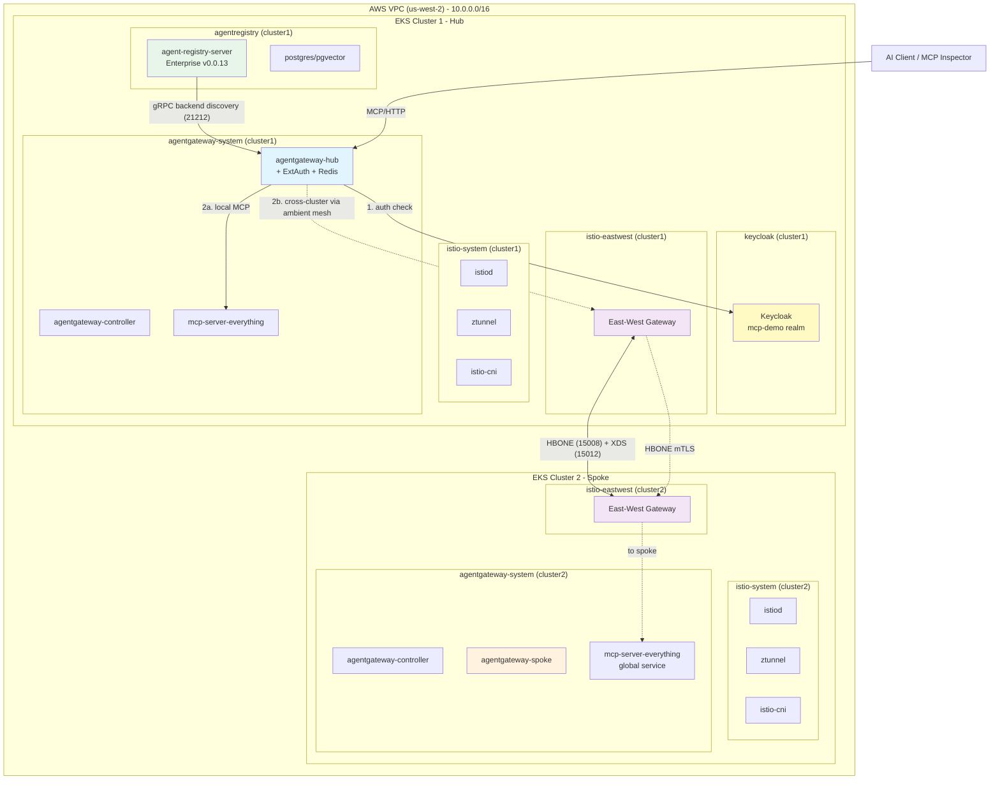

# Multicluster Istio Ambient + AgentGateway Enterprise Demo

## Architecture Overview



---

## Authentication with AgentGateway + Keycloak

AgentGateway supports two authentication flows for MCP traffic. Use the one that matches your client type.

| | Flow 1: User auth | Flow 2: MCP auth |
|---|---|---|
| **Who uses it** | Human operators, browsers, dashboards | MCP clients — Claude Code, VS Code, MCP Inspector |
| **Mechanism** | OIDC authorization code (browser redirect + session cookie) | MCP OAuth — dynamic discovery → client registration → JWT |
| **AGW config** | `EnterpriseAgentgatewayPolicy` → `entExtAuth` → `AuthConfig` | `AgentgatewayPolicy` → `jwtAuthentication` + `mcp` extension |
| **Token storage** | Redis session (ext-cache) | Stateless JWT, validated against Keycloak JWKS |
| **Redirect on unauthed** | 302 → Keycloak login page | 401 + `WWW-Authenticate` header (MCP discovery) |

---

## Flow 1 — User Auth (OIDC Authorization Code)

For human operators accessing MCP via a browser or dashboard. An unauthenticated request redirects to the Keycloak login page; after login a session cookie is issued and stored in Redis.

**Prerequisites:** AgentGateway Enterprise with `extAuth` and `extCache` (Redis) enabled. Set env vars:

```bash
export KEYCLOAK_URL=http://keycloak.keycloak.svc.cluster.local:8080
export KEYCLOAK_REALM=mcp-demo
export KEYCLOAK_CLIENT_ID=agw-client
export KEYCLOAK_CLIENT_SECRET=agw-client-secret
export AGW_LB=$(kubectl -n agentgateway-system get svc agentgateway-hub \
  -o jsonpath='{.status.loadBalancer.ingress[0].hostname}{.status.loadBalancer.ingress[0].ip}')
```

### Step 1 — Store the client secret

```bash
kubectl apply -f - <<EOF
apiVersion: v1
kind: Secret
metadata:
  name: oauth-keycloak
  namespace: agentgateway-system
type: extauth.solo.io/oauth
stringData:
  client-secret: ${KEYCLOAK_CLIENT_SECRET}
EOF
```

### Step 2 — Create the AuthConfig

```yaml
apiVersion: extauth.solo.io/v1
kind: AuthConfig
metadata:
  name: oidc-keycloak
  namespace: agentgateway-system
spec:
  configs:
  - oauth2:
      oidcAuthorizationCode:
        appUrl: "http://${AGW_LB}"
        callbackPath: /callback
        clientId: ${KEYCLOAK_CLIENT_ID}
        clientSecretRef:
          name: oauth-keycloak
          namespace: agentgateway-system
        issuerUrl: "${KEYCLOAK_URL}/realms/${KEYCLOAK_REALM}/"
        scopes:
        - openid
        - email
        - profile
        session:
          failOnFetchFailure: true
          redis:
            cookieName: keycloak-session
            options:
              host: ext-cache-enterprise-agentgateway:6379
        headers:
          idTokenHeader: x-user-token
```

```bash
kubectl apply -f authconfig-oidc-keycloak.yaml
kubectl get authconfig oidc-keycloak -n agentgateway-system -o jsonpath='{.status.state}'
# Expected: Accepted
```

### Step 3 — Attach the AuthConfig to the Gateway

```yaml
apiVersion: enterpriseagentgateway.solo.io/v1alpha1
kind: EnterpriseAgentgatewayPolicy
metadata:
  name: oidc-extauth
  namespace: agentgateway-system
spec:
  targetRefs:
  - group: gateway.networking.k8s.io
    kind: Gateway
    name: agentgateway-hub
  traffic:
    entExtAuth:
      authConfigRef:
        name: oidc-keycloak
        namespace: agentgateway-system
      backendRef:
        name: ext-auth-service-enterprise-agentgateway
        namespace: agentgateway-system
        port: 8083
```

### Step 4 — Verify

```bash
# Unauthenticated → 302 redirect to Keycloak login page
curl -s -o /dev/null -w '%{http_code}\n' "http://${AGW_LB}/mcp"
# Expected: 302

# Location header points to Keycloak
curl -sI "http://${AGW_LB}/mcp" | grep -i location
```

### Cleanup

```bash
kubectl delete authconfig oidc-keycloak -n agentgateway-system
kubectl delete enterpriseagentgatewaypolicy oidc-extauth -n agentgateway-system
kubectl delete secret oauth-keycloak -n agentgateway-system
```

---

## Flow 2 — MCP Auth (AgentgatewayPolicy + jwtAuthentication)

For MCP clients such as Claude Code, VS Code with MCP extensions, and MCP Inspector. These clients implement the MCP OAuth 2.0 specification: they discover the authorization server automatically from the gateway, register as a dynamic client with Keycloak, complete the authorization code flow, and then connect using a Bearer JWT — all without manual token handling.

An unauthenticated MCP client receives `401 Unauthorized` with a `WWW-Authenticate` header pointing to the discovery endpoint. The client uses that to locate Keycloak and complete the flow autonomously.

**Prerequisites:** Keycloak realm configured with a client that allows dynamic client registration, and the Keycloak JWKS path. Set env vars:

```bash
export KEYCLOAK_URL=http://keycloak.keycloak.svc.cluster.local:8080
export KEYCLOAK_REALM=mcp-demo
export KEYCLOAK_ISSUER="${KEYCLOAK_URL}/realms/${KEYCLOAK_REALM}"
export KEYCLOAK_JWKS_PATH="/realms/${KEYCLOAK_REALM}/protocol/openid-connect/certs"
export AGW_LB=$(kubectl -n agentgateway-system get svc agentgateway-hub \
  -o jsonpath='{.status.loadBalancer.ingress[0].hostname}{.status.loadBalancer.ingress[0].ip}')
```

### Step 1 — Apply the AgentgatewayPolicy

`jwtAuthentication` validates Bearer JWTs from Keycloak. The `mcp` block enables the MCP OAuth discovery endpoints and tells AgentGateway to use Keycloak-specific endpoint handling (Keycloak does not fully implement standard dynamic client registration).

```yaml
apiVersion: agentgateway.dev/v1alpha1
kind: AgentgatewayPolicy
metadata:
  name: mcp-authn
  namespace: agentgateway-system
spec:
  targetRefs:
  - group: gateway.networking.k8s.io
    kind: HTTPRoute
    name: mcp-route
  traffic:
    jwtAuthentication:
      mode: Strict
      providers:
      - issuer: "${KEYCLOAK_ISSUER}"
        audiences:
        - "http://${AGW_LB}/mcp"
        jwks:
          remote:
            backendRef:
              name: keycloak
              kind: Service
              namespace: keycloak
              port: 8080
            jwksPath: "${KEYCLOAK_JWKS_PATH}"
      mcp:
        provider: Keycloak
        resourceMetadata:
          resource: "http://${AGW_LB}/mcp"
          scopesSupported:
          - openid
          - email
          - profile
          bearerMethodsSupported:
          - header
          - body
          - query
```

```bash
kubectl apply -f mcp-authn-policy.yaml
kubectl get agentgatewaypolicy mcp-authn -n agentgateway-system
```

### Step 2 — Update HTTPRoute to expose discovery paths

The MCP OAuth flow requires two well-known discovery paths on the gateway. Add them to the existing MCP HTTPRoute so clients can locate the authorization server.

```yaml
apiVersion: gateway.networking.k8s.io/v1
kind: HTTPRoute
metadata:
  name: mcp-route
  namespace: agentgateway-system
spec:
  parentRefs:
  - name: agentgateway-hub
    namespace: agentgateway-system
  rules:
  - backendRefs:
    - group: agentgateway.dev
      kind: AgentgatewayBackend
      name: mcp-backends
    matches:
    - path:
        type: PathPrefix
        value: /mcp
    - path:
        type: PathPrefix
        value: /.well-known/oauth-protected-resource/mcp   # MCP resource metadata discovery
    - path:
        type: PathPrefix
        value: /.well-known/oauth-authorization-server/mcp  # MCP auth server discovery
    - path:
        type: PathPrefix
        value: /realms/mcp-demo/protocol/openid-connect/certs  # Keycloak JWKS (proxied)
```

### Step 3 — Verify with MCP Inspector

Point MCP Inspector at `http://${AGW_LB}/mcp`. On first connection it will:

1. Receive `401` with `WWW-Authenticate` pointing to `/.well-known/oauth-protected-resource/mcp`
2. Discover the authorization server metadata
3. Register as a dynamic client with Keycloak
4. Complete authorization code flow (browser login)
5. Reconnect with Bearer token — tools are now accessible

```bash
# Unauthenticated → 401 with WWW-Authenticate header (not 302)
curl -si "http://${AGW_LB}/mcp" \
  -H "Content-Type: application/json" \
  | grep -E "^HTTP/|^WWW-Authenticate:"
# Expected:
# HTTP/1.1 401 Unauthorized
# WWW-Authenticate: Bearer realm="...", resource_metadata="http://${AGW_LB}/.well-known/oauth-protected-resource/mcp"
```

### Reference

- [AgentGateway — MCP Auth vs JWT Auth](https://agentgateway.dev/docs/kubernetes/main/mcp/auth/about/#mcp-auth-vs-jwt-auth)
- [AgentGateway — Set up MCP Auth](https://agentgateway.dev/docs/kubernetes/main/mcp/auth/setup/)
- [AgentGateway — Keycloak setup for MCP Auth](https://agentgateway.dev/docs/kubernetes/main/mcp/auth/keycloak/)

---

## Container Images & Helm Repositories

> **Add these to your artifact repository before proceeding if operating in an air-gapped environment.**

### Istio Images (Solo Enterprise, 1.29.1)

| Image | Full Path |
|-------|-----------|
| pilot (istiod) | `us-docker.pkg.dev/soloio-img/istio/pilot:1.29.1-solo-distroless` |
| proxyv2 | `us-docker.pkg.dev/soloio-img/istio/proxyv2:1.29.1-solo-distroless` |
| ztunnel | `us-docker.pkg.dev/soloio-img/istio/ztunnel:1.29.1-solo-distroless` |
| istio-cni | `us-docker.pkg.dev/soloio-img/istio/install-cni:1.29.1-solo-distroless` |

### Istio Helm Charts (OCI)

| Chart | OCI Path |
|-------|----------|
| base | `oci://us-docker.pkg.dev/soloio-img/istio-helm/base --version 1.29.1-solo` |
| istiod | `oci://us-docker.pkg.dev/soloio-img/istio-helm/istiod --version 1.29.1-solo` |
| cni | `oci://us-docker.pkg.dev/soloio-img/istio-helm/cni --version 1.29.1-solo` |
| ztunnel | `oci://us-docker.pkg.dev/soloio-img/istio-helm/ztunnel --version 1.29.1-solo` |
| peering | `oci://us-docker.pkg.dev/soloio-img/istio-helm/peering --version 1.29.1-solo` |

### AgentGateway Enterprise Images (v2.3.0-rc.3)

| Image | Full Path |
|-------|-----------|
| controller | `us-docker.pkg.dev/solo-public/enterprise-agentgateway/enterprise-agentgateway-controller:2.3.0-rc.3` |
| proxy | `us-docker.pkg.dev/solo-public/enterprise-agentgateway/agentgateway-enterprise:2.3.0-rc.3` |
| ext-auth-service | `gcr.io/gloo-mesh/ext-auth-service:0.78.0` |
| rate-limiter | `gcr.io/gloo-mesh/rate-limiter:0.18.1` |
| redis (cache) | `docker.io/redis:7.2.12-alpine` |

### AgentGateway Helm Charts (OCI)

| Chart | OCI Path |
|-------|----------|
| enterprise-agentgateway-crds | `oci://us-docker.pkg.dev/solo-public/enterprise-agentgateway/charts/enterprise-agentgateway-crds --version v2.3.0-rc.3` |
| enterprise-agentgateway | `oci://us-docker.pkg.dev/solo-public/enterprise-agentgateway/charts/enterprise-agentgateway --version v2.3.0-rc.3` |

### AgentRegistry Images

| Image | Full Path |
|-------|-----------|
| server | `docker.io/pmuir/agentregistry-server:add-agentgateway-resource` |
| postgres/pgvector (bundled) | `docker.io/pgvector/pgvector:pg18` |

### AgentRegistry Helm Chart

| Chart | OCI Path |
|-------|----------|
| agentregistry | `oci://ghcr.io/agentregistry-dev/agentregistry/charts/agentregistry` |

### Gloo Mesh Enterprise Images (v2.12.3)

| Image | Full Path |
|-------|-----------|
| mgmt-server | `gcr.io/gloo-mesh/gloo-mesh-mgmt-server:2.12.3` |
| agent | `gcr.io/gloo-mesh/gloo-mesh-agent:2.12.3` |
| ui | `gcr.io/gloo-mesh/gloo-mesh-ui:2.12.3` |
| analyzer | `gcr.io/gloo-mesh/gloo-mesh-analyzer:2.12.3` |
| apiserver | `gcr.io/gloo-mesh/gloo-mesh-apiserver:2.12.3` |
| insights | `gcr.io/gloo-mesh/gloo-mesh-insights:2.12.3` |
| envoy (UI sidecar) | `gcr.io/gloo-mesh/gloo-mesh-envoy:2.12.3` |
| otel-collector | `gcr.io/gloo-mesh/otel-collector:0.2.0` |
| rate-limiter | `gcr.io/gloo-mesh/rate-limiter:0.11.7` |
| redis | `gcr.io/gloo-mesh/redis:7.2.4-alpine` |
| prometheus | `gcr.io/gloo-mesh/prometheus:v2.49.1` |
| opa | `gcr.io/gloo-mesh/opa:0.59.0` |
| postgresql (bundled) | `docker.io/bitnami/postgresql:16.1.0-debian-11-r15` |
| kube-rbac-proxy | `quay.io/brancz/kube-rbac-proxy:v0.14.0` |
| configmap-reload | `docker.io/jimmidyson/configmap-reload:v0.8.0` |

### Gloo Mesh Enterprise Helm Chart

| Chart | Source |
|-------|--------|
| gloo-platform | `helm repo add gloo-platform https://storage.googleapis.com/gloo-platform/helm-charts` |
| chart name | `gloo-platform/gloo-platform --version 2.12.3` |

### Dex OIDC Provider (Phase 3)

| Image | Full Path |
|-------|-----------|
| dex | `ghcr.io/dexidp/dex:v2.42.0` |

### Bookinfo Images

| Image | Full Path |
|-------|-----------|
| productpage | `docker.io/istio/examples-bookinfo-productpage-v1:1.20.3` |
| details | `docker.io/istio/examples-bookinfo-details-v1:1.20.3` |
| ratings | `docker.io/istio/examples-bookinfo-ratings-v1:1.20.3` |
| reviews-v1 | `docker.io/istio/examples-bookinfo-reviews-v1:1.20.3` |
| reviews-v2 | `docker.io/istio/examples-bookinfo-reviews-v2:1.20.3` |
| reviews-v3 | `docker.io/istio/examples-bookinfo-reviews-v3:1.20.3` |

### Debug Images

| Image | Full Path |
|-------|-----------|
| netshoot | `nicolaka/netshoot:latest` |

### Dummy MCP Server Images

| Image | Full Path |
|-------|-----------|
| node | `node:22-alpine` |

### Gateway API CRDs

| Resource | URL |
|----------|-----|
| Gateway API v1.4.0 | `https://github.com/kubernetes-sigs/gateway-api/releases/download/v1.4.0/standard-install.yaml` |

---

## EKS Cluster Versions

| Component | Version |
|-----------|---------|
| Kubernetes (EKS) | 1.33 |
| EKS Platform | v1.33.8-eks-f69f56f |
| Instance Type | t3.large (2 vCPU, 8 GiB) |
| Nodes per Cluster | 2 |
| Region | us-west-2 |

---

## Firewall Rules

The following ports must be open for the multicluster mesh, agentgateway, and agent registry to function.

### Inter-Cluster (East-West Gateway Peering) — Required

| Port | Protocol | Direction | Purpose |
|------|----------|-----------|---------|
| **15008** | HBONE (mTLS over HTTP/2) | Cluster 1 EW GW <--> Cluster 2 EW GW | Cross-cluster data plane traffic. Double HBONE tunneling — outer mTLS terminates at the east-west gateway, inner mTLS forwards to the target ztunnel. |
| **15012** | TLS (gRPC) | Cluster 1 <--> Cluster 2 | Cross-cluster xDS control plane and CA services. Enables each cluster's istiod to distribute configuration to remote peers. |

> Both listeners use TLS passthrough mode on the Gateway resource. If either port is blocked, `istioctl multicluster check` will show `gloo.solo.io/PeerConnected: False`.

### EKS / Kubernetes — Required

| Port | Protocol | Direction | Purpose |
|------|----------|-----------|---------|
| 443 | HTTPS | EKS API server --> istiod pod | Kubernetes admission webhooks. Ambient mode avoids sidecar injection webhooks, but istiod still needs this for validation. |
| 10250 | TCP | EKS API server --> kubelet | Standard kubelet API (AWS-managed, open by default in EKS security groups). |

### North-South Ingress — Required

| Port | Protocol | Direction | Purpose |
|------|----------|-----------|---------|
| 80 | HTTP | External clients --> AgentGateway LB (cluster 1) | AI client traffic to the hub agentgateway-proxy. |
| 443 | HTTPS | External clients --> AgentGateway LB (cluster 1) | AI client traffic (TLS). |

### AWS Security Group Rules

The EKS-managed security groups (one per cluster) need rules allowing traffic from the other cluster's security group on ports **15008** and **15012**:

```bash
# Replace with your actual security group IDs
export CLUSTER1_SG=<cluster1-security-group-id>
export CLUSTER2_SG=<cluster2-security-group-id>

# Allow cluster2 to reach cluster1 east-west gateway
aws ec2 authorize-security-group-ingress --group-id ${CLUSTER1_SG} \
  --protocol tcp --port 15008 --source-group ${CLUSTER2_SG}
aws ec2 authorize-security-group-ingress --group-id ${CLUSTER1_SG} \
  --protocol tcp --port 15012 --source-group ${CLUSTER2_SG}

# Allow cluster1 to reach cluster2 east-west gateway
aws ec2 authorize-security-group-ingress --group-id ${CLUSTER2_SG} \
  --protocol tcp --port 15008 --source-group ${CLUSTER1_SG}
aws ec2 authorize-security-group-ingress --group-id ${CLUSTER2_SG} \
  --protocol tcp --port 15012 --source-group ${CLUSTER1_SG}
```

---

## Prerequisites

- `kubectl` installed and configured with context access to the target cluster
- `helm` 3.x installed
- `openssl` installed (for JWT key generation)
- Solo `istioctl` installed (see below)
- All container images and helm charts mirrored to your artifact repository (if air-gapped)
- **StorageClass with a working provisioner** — Agent Registry requires a PersistentVolumeClaim for its bundled PostgreSQL. On EKS, this requires:
  - The **EBS CSI driver** addon installed (with IRSA — see below)
  - The `gp2` StorageClass annotated as default: `kubectl annotate storageclass gp2 storageclass.kubernetes.io/is-default-class=true`

### EKS EBS CSI Driver Setup (required for Agent Registry)

The Agent Registry's bundled PostgreSQL needs persistent storage. EKS does not include the EBS CSI driver by default.

```bash
# 1. Create OIDC provider for the cluster (if not already done)
eksctl utils associate-iam-oidc-provider --cluster <cluster-name> --region <region> --approve

# 2. Create IRSA role for the EBS CSI driver
eksctl create iamserviceaccount \
  --name ebs-csi-controller-sa \
  --namespace kube-system \
  --cluster <cluster-name> \
  --region <region> \
  --role-name <cluster-name>-ebs-csi \
  --attach-policy-arn arn:aws:iam::aws:policy/service-role/AmazonEBSCSIDriverPolicy \
  --approve \
  --override-existing-serviceaccounts

# 3. Install the EBS CSI addon with the IRSA role
EBS_ROLE_ARN=$(aws iam get-role --role-name <cluster-name>-ebs-csi --query 'Role.Arn' --output text)
aws eks create-addon \
  --cluster-name <cluster-name> \
  --addon-name aws-ebs-csi-driver \
  --service-account-role-arn "${EBS_ROLE_ARN}" \
  --region <region>

# 4. Wait for addon to be active
aws eks wait addon-active --cluster-name <cluster-name> --addon-name aws-ebs-csi-driver --region <region>

# 5. Set gp2 as the default StorageClass
kubectl annotate storageclass gp2 storageclass.kubernetes.io/is-default-class=true
```

> This is only required on the hub cluster where Agent Registry is installed. If Agent Registry is configured with an external PostgreSQL (`database.postgres.url`), the EBS CSI driver is not needed.

### Install Solo istioctl

```bash
curl -sSfL https://raw.githubusercontent.com/solo-io/gloo-mesh-use-cases/main/gloo-mesh/install-istioctl.sh | bash
export PATH=${HOME}/.istioctl/bin:${PATH}
istioctl version
```

### Install Solo Docs MCP Server (optional)

[search.solo.io](https://search.solo.io) is an MCP server for AI-powered search across Solo.io product documentation.

**Claude Code:**

```bash
claude mcp add --transport http soloio-docs-mcp https://search.solo.io/mcp
```

**Cursor** (`~/.cursor/mcp.json`):

```json
{
  "mcpServers": {
    "soloio-docs-mcp": {
      "url": "https://search.solo.io/mcp"
    }
  }
}
```

**VS Code** (`.vscode/mcp.json`):

```json
{
  "servers": {
    "soloio-docs-mcp": {
      "type": "http",
      "url": "https://search.solo.io/mcp"
    }
  }
}
```

---

## Certificate Generation (Shared Root of Trust)

Multicluster Istio requires all clusters to share a common root CA. Each cluster gets its own intermediate CA derived from that root.

### Generate Certificates

From a machine with internet access (or use a pre-downloaded Istio distribution):

```bash
# Download Istio distribution for cert generation tools
curl -L https://istio.io/downloadIstio | ISTIO_VERSION=1.29.1 sh -
cd istio-1.29.1

# Generate root CA
mkdir -p certs && cd certs
make -f ../tools/certs/Makefile.selfsigned.mk root-ca

# Generate intermediate CA for cluster 1
make -f ../tools/certs/Makefile.selfsigned.mk cluster1-cacerts

# Generate intermediate CA for cluster 2
make -f ../tools/certs/Makefile.selfsigned.mk cluster2-cacerts
```

This produces two directories — `cluster1/` and `cluster2/` — each containing:
- `ca-cert.pem` — intermediate CA certificate
- `ca-key.pem` — intermediate CA private key
- `root-cert.pem` — root CA certificate
- `cert-chain.pem` — full certificate chain

### Distribute Certificates to Jumpboxes

> **Air-gapped / isolated jumpbox environments:** Each cluster's jumpbox needs only its own intermediate CA directory. Securely copy the appropriate `cluster1/` or `cluster2/` directory to the corresponding jumpbox. The `01-install.sh` script reads certificates from the path specified by `CACERTS_DIR`.

---

## Phase 1: Per-Cluster Installation (`scripts/01-install.sh`)

This script installs all components on a single cluster. Run it once per cluster from the cluster's jumpbox. **No cross-cluster operations occur in this phase.**

### Parameters

| Variable | Required | Default | Description |
|----------|----------|---------|-------------|
| `CLUSTER_NAME` | Yes | — | Cluster identity (e.g. `cluster1`) |
| `NETWORK_NAME` | Yes | — | Istio network name (e.g. `cluster1`) |
| `GLOO_MESH_LICENSE_KEY` | Yes | — | Solo Enterprise for Istio license key |
| `AGENTGATEWAY_LICENSE_KEY` | Yes | — | AgentGateway Enterprise license key |
| `CACERTS_DIR` | Yes | — | Path to directory with CA cert files |
| `KUBE_CONTEXT` | No | `${CLUSTER_NAME}` | kubectl context to use |
| `ISTIO_VERSION` | No | `1.29.1` | Istio version |
| `ISTIO_REPO` | No | `us-docker.pkg.dev/soloio-img/istio` | Image registry (override for artifact repo) |
| `ISTIO_HELM_REPO` | No | `us-docker.pkg.dev/soloio-img/istio-helm` | Helm chart registry (override for artifact repo) |
| `AGW_HELM_REPO` | No | `us-docker.pkg.dev/solo-public/enterprise-agentgateway/charts` | AgentGateway helm chart registry |
| `AGW_VERSION` | No | `v2.3.0-rc.3` | AgentGateway Enterprise version |
| `GATEWAY_API_CRDS_FILE` | No | (fetches from GitHub) | Local path to Gateway API CRDs yaml |
| `BOOKINFO_MANIFEST` | No | (fetches from GitHub) | Local path to bookinfo manifest |
| `NETSHOOT_IMAGE` | No | `nicolaka/netshoot:latest` | Debug pod image |
| `NODE_IMAGE` | No | `node:22-alpine` | MCP server base image |
| `INSTALL_AGENT_REGISTRY` | No | `false` | Set `true` on hub cluster |
| `AREG_CHART_PATH` | No | — | Path to agent registry helm chart (required if above is `true`) |

### What it installs

1. Gateway API CRDs
2. Istio ambient (base, istiod, cni, ztunnel) with cluster-specific network identity
3. Bookinfo sample application (enrolled in ambient mesh)
4. Netshoot debug pod (enrolled in ambient mesh)
5. East-west gateway (local only — no peering yet)
6. AgentGateway Enterprise (CRDs + control plane)
7. Dummy MCP server (`mcp-server-everything`)
8. Agent Registry (hub cluster only, when `INSTALL_AGENT_REGISTRY=true`)
   - Uses `pgvector/pgvector:pg18` image (not standard postgres) for pgvector extension support
   - Auto-generates a JWT signing key via `openssl rand -hex 32`
   - Requires a default StorageClass with working provisioner (see Prerequisites)

### Example: Hub Cluster (Cluster 1)

```bash
export CLUSTER_NAME=cluster1
export NETWORK_NAME=cluster1
export KUBE_CONTEXT=cluster1
export GLOO_MESH_LICENSE_KEY=<your-key>
export AGENTGATEWAY_LICENSE_KEY=<your-key>
export CACERTS_DIR=./certs/cluster1
export INSTALL_AGENT_REGISTRY=true
export AREG_CHART_PATH=./charts/agentregistry

# Override for artifact repo (if air-gapped)
# export ISTIO_REPO=my-registry.internal/soloio-img/istio
# export ISTIO_HELM_REPO=my-registry.internal/soloio-img/istio-helm
# export AGW_HELM_REPO=my-registry.internal/solo-public/enterprise-agentgateway/charts
# export GATEWAY_API_CRDS_FILE=./manifests/gateway-api-v1.4.0.yaml
# export BOOKINFO_MANIFEST=./manifests/bookinfo.yaml

./scripts/01-install.sh
```

### Example: Spoke Cluster (Cluster 2)

```bash
export CLUSTER_NAME=cluster2
export NETWORK_NAME=cluster2
export KUBE_CONTEXT=cluster2
export GLOO_MESH_LICENSE_KEY=<your-key>
export AGENTGATEWAY_LICENSE_KEY=<your-key>
export CACERTS_DIR=./certs/cluster2

./scripts/01-install.sh
```

### Post-install: Record East-West Gateway Address

After `01-install.sh` completes, note the east-west gateway address printed at the end. You will need both clusters' addresses for Phase 2.

```bash
kubectl get svc -n istio-eastwest istio-eastwest -o jsonpath="{.status.loadBalancer.ingress[0].hostname}"
```

---

## Phase 2: Cross-Cluster Configuration (`scripts/02-configure.sh`)

Run this **after** Phase 1 has been completed and validated on both clusters. This script establishes peering and configures the AgentGateway proxy role (hub or spoke).

### Parameters

| Variable | Required | Default | Description |
|----------|----------|---------|-------------|
| `CLUSTER_NAME` | Yes | — | Local cluster name |
| `NETWORK_NAME` | Yes | — | Local network name |
| `REMOTE_CLUSTER_NAME` | Yes | — | Remote cluster name |
| `REMOTE_NETWORK_NAME` | Yes | — | Remote network name |
| `REMOTE_EW_ADDRESS` | Yes | — | Remote cluster's east-west gateway hostname or IP |
| `GATEWAY_ROLE` | Yes | — | `hub` or `spoke` |
| `KUBE_CONTEXT` | No | `${CLUSTER_NAME}` | kubectl context |
| `REMOTE_EW_ADDRESS_TYPE` | No | `Hostname` | `Hostname` (AWS ELB) or `IPAddress` |
| `ISTIO_HELM_REPO` | No | `us-docker.pkg.dev/soloio-img/istio-helm` | Helm chart registry |
| `REGION` | No | `us-west-2` | AWS region |

### What it configures

1. Installs peering-remote helm chart pointing to the remote cluster's east-west gateway
2. Creates the AgentGateway `Gateway` resource (named `agentgateway-hub` or `agentgateway-spoke`)
3. Creates `HTTPRoute` for MCP traffic routing
4. Creates `AgentgatewayBackend` for local MCP server discovery

### Example: Configure Hub (Cluster 1)

```bash
export CLUSTER_NAME=cluster1
export NETWORK_NAME=cluster1
export REMOTE_CLUSTER_NAME=cluster2
export REMOTE_NETWORK_NAME=cluster2
export REMOTE_EW_ADDRESS=<cluster2-ew-gateway-hostname>
export GATEWAY_ROLE=hub

./scripts/02-configure.sh
```

### Example: Configure Spoke (Cluster 2)

```bash
export CLUSTER_NAME=cluster2
export NETWORK_NAME=cluster2
export REMOTE_CLUSTER_NAME=cluster1
export REMOTE_NETWORK_NAME=cluster1
export REMOTE_EW_ADDRESS=<cluster1-ew-gateway-hostname>
export GATEWAY_ROLE=spoke

./scripts/02-configure.sh
```

---

## Phase 3: Dex OIDC Provider (`scripts/03-dex.sh`)

Deploys [Dex](https://dexidp.io/) v2.42.0 on cluster1 as a lightweight OIDC provider using plain Kubernetes manifests (no Helm). Dex acts as the identity provider for both Flow 1 (user auth via ExtAuth) and Bearer token validation. Run after Phase 2, before Phase 5.

> **Flow 2 (MCP Auth with dynamic discovery)**: If you need MCP clients such as Claude Code or MCP Inspector to auto-discover and self-register with the IdP (the full MCP OAuth flow), replace Dex with Keycloak or Auth0. See the [Authentication section](#authentication-with-agentgateway--keycloak) at the top of this document. Dex does not implement dynamic client registration as required by the MCP OAuth spec.

### Parameters

| Variable | Required | Default | Description |
|----------|----------|---------|-------------|
| `KUBE_CONTEXT` | No | `cluster1` | kubectl context |
| `DEX_NAMESPACE` | No | `dex` | Namespace to deploy Dex into |
| `DEX_CLIENT_ID` | No | `agw-client` | OIDC client ID used by AgentGateway |
| `DEX_CLIENT_SECRET` | No | `agw-client-secret` | OIDC client secret — **change for real use** |
| `DEX_USER_EMAIL` | No | `demo@example.com` | Demo user email |
| `DEX_USER_PASSWORD` | No | `demo-pass` | Demo user password — **change for real use** |
| `DEX_USER_NAME` | No | `demo-user` | Demo user display name |
| `AGW_LB` | No | — | AgentGateway LB address (added to Dex redirect URIs) |

### Example

```bash
export KUBE_CONTEXT=cluster1

./scripts/03-dex.sh
```

### What it creates

- `dex` namespace (enrolled in ambient mesh)
- `dex-config` ConfigMap — Dex config with static OIDC clients and a hashed demo user password
- `dex` Deployment running `ghcr.io/dexidp/dex:v2.42.0`
- `dex` ClusterIP Service on port 5556

### Access

```bash
# Port-forward Dex locally (for token acquisition in demo/testing)
kubectl --context cluster1 -n dex port-forward svc/dex 5556:5556

# Verify OIDC discovery endpoint
curl http://localhost:5556/dex/.well-known/openid-configuration | jq .issuer
# Expected: "http://dex.dex.svc.cluster.local:5556/dex"

# Acquire a JWT (password grant — for MCP client / service-to-service use)
TOKEN=$(curl -s -X POST http://localhost:5556/dex/token \
  -H 'Content-Type: application/x-www-form-urlencoded' \
  -d 'grant_type=password&username=demo@example.com&password=demo-pass' \
  -d 'client_id=agw-client&client_secret=agw-client-secret&scope=openid+email+profile' \
  | jq -r '.access_token')
```

### Dex internal URL (for AgentGateway)

```
http://dex.dex.svc.cluster.local:5556/dex
```

OIDC discovery: `http://dex.dex.svc.cluster.local:5556/dex/.well-known/openid-configuration`

---

## Phase 4: Enterprise AgentRegistry (`scripts/04-areg-enterprise.sh`)

Upgrades the community AgentRegistry (0.2.1) to **AgentRegistry Enterprise v0.0.13** and connects it to AgentGateway as a backend discovery source.

### Parameters

| Variable | Required | Default | Description |
|----------|----------|---------|-------------|
| `KUBE_CONTEXT` | No | `cluster1` | kubectl context |
| `AREG_NAMESPACE` | No | `agentregistry` | Namespace for AgentRegistry |
| `AREG_HELM_REPO` | No | `oci://us-docker.pkg.dev/agentregistry/enterprise/helm/agentregistry-enterprise` | OCI chart path |
| `AREG_VERSION` | No | `0.0.13` | Chart version (no `v` prefix) |
| `AREG_JWT_KEY` | No | _(random)_ | JWT signing key — set to a stable value to avoid session invalidation on re-runs |
| `DEX_CLIENT_ID` | No | `agw-client` | Dex OIDC client ID used by AgentRegistry |
| `DEX_CLIENT_SECRET` | No | `agw-client-secret` | Dex OIDC client secret |

### Example

```bash
export KUBE_CONTEXT=cluster1
# Optional: pin the JWT key so re-runs don't invalidate existing sessions
export AREG_JWT_KEY=$(openssl rand -hex 32)

./scripts/04-areg-enterprise.sh
```

### What it does

1. `helm upgrade --install agentregistry` in the existing `agentregistry` namespace (existing PVC preserved)
2. Keeps bundled PostgreSQL/pgvector, enables built-in seed data (363 MCP server catalog)
3. Creates `AgentgatewayBackend` wiring AREG MCP port (31313) to AgentGateway at `/mcp/registry`
4. Creates `HTTPRoute` routing `/mcp/registry` → the AREG backend through the hub gateway

### Access AgentRegistry UI

```bash
# UI (port 8080)
kubectl --context cluster1 -n agentregistry port-forward svc/agentregistry-agentregistry-enterprise 8080:8080
# Open: http://localhost:8080

# MCP endpoint (port 31313) — requires Bearer token
kubectl --context cluster1 -n agentregistry port-forward svc/agentregistry-agentregistry-enterprise 31313:31313
# POST http://localhost:31313/mcp with Authorization: Bearer <token>
```

> The built-in seed data populates ~363 MCP server entries. Disable with
> `config.disableBuiltinSeed=true` if you want a clean slate.

---

## Phase 5: Authentication (`scripts/05-extauth.sh`)

Configures **Flow 1 (User Auth)** on the AgentGateway Hub: the ExtAuth sidecar + Redis validate Dex OIDC sessions. Unauthenticated browser requests receive a 302 redirect to the Dex login page; authenticated requests (Bearer token or session cookie) pass through to the MCP backend.

> **Flow 2 (MCP Auth)**: See the [Authentication section](#authentication-with-agentgateway--keycloak) at the top of this document. Full MCP OAuth dynamic discovery (for Claude Code, VS Code, MCP Inspector) requires replacing Dex with Keycloak or Auth0 and using `AgentgatewayPolicy` with `jwtAuthentication` + `mcp` extension.

### Prerequisites

- Phase 3 (`03-dex.sh`) must be complete — Dex must be running
- `AGENTGATEWAY_LICENSE_KEY` must be set

### Parameters

| Variable | Required | Default | Description |
|----------|----------|---------|-------------|
| `AGENTGATEWAY_LICENSE_KEY` | **Yes** | — | AGW Enterprise license key |
| `KUBE_CONTEXT` | No | `cluster1` | kubectl context |
| `DEX_NAMESPACE` | No | `dex` | Namespace where Dex is running |
| `DEX_CLIENT_ID` | No | `agw-client` | Dex OIDC client ID (must match Phase 3) |
| `DEX_CLIENT_SECRET` | No | `agw-client-secret` | Dex client secret (must match Phase 3) |
| `AGW_VERSION` | No | `v2.3.0-rc.3` | AgentGateway Enterprise version |

### Example

```bash
export KUBE_CONTEXT=cluster1
export AGENTGATEWAY_LICENSE_KEY=<key>

./scripts/05-extauth.sh
```

### What it creates

- `oauth-dex` Secret — Dex client secret
- `dex-backend` AgentgatewayBackend — static route to Dex service
- `oidc-dex` AuthConfig — OIDC authorization code flow via Dex
- `oidc-extauth` EnterpriseAgentgatewayPolicy — attaches ExtAuth to `agentgateway-hub` Gateway

### Test the auth flow

```bash
# Port-forward hub gateway
kubectl --context cluster1 -n agentgateway-system port-forward svc/agentgateway-hub 8080:80 &

# Port-forward Dex (for token acquisition)
kubectl --context cluster1 -n dex port-forward svc/dex 5556:5556 &

# Flow 1 — Unauthenticated browser request → 302 redirect to Dex login page
curl -s -o /dev/null -w '%{http_code}\n' http://localhost:8080/mcp
# Expected: 302

# MCP client — acquire JWT from Dex (password grant)
TOKEN=$(curl -s -X POST http://localhost:5556/dex/token \
  -H 'Content-Type: application/x-www-form-urlencoded' \
  -d 'grant_type=password&username=demo@example.com&password=demo-pass' \
  -d 'client_id=agw-client&client_secret=agw-client-secret&scope=openid+email+profile' \
  | jq -r '.access_token')

# Authenticated MCP initialize — 200 OK + Mcp-Session-Id header
curl -si -X POST http://localhost:8080/mcp \
  -H "Authorization: Bearer ${TOKEN}" \
  -H "Content-Type: application/json" \
  -H "Accept: application/json, text/event-stream" \
  -d '{"jsonrpc":"2.0","id":1,"method":"initialize","params":{"protocolVersion":"2024-11-05","capabilities":{},"clientInfo":{"name":"demo","version":"1.0"}}}' \
  | grep -E "^HTTP/|^Mcp-Session-Id:"
```

---

## Phase 6: Cross-Cluster MCP Routing (`scripts/06-cross-cluster-mcp.sh`)

Labels the MCP server on cluster2 as a global mesh service and adds a cross-cluster route on the hub gateway, demonstrating AGW-as-waypoint for east-west MCP traffic — Solo's key differentiator vs Red Hat.

### Parameters

| Variable | Required | Default | Description |
|----------|----------|---------|-------------|
| `CLUSTER1_CONTEXT` | No | `cluster1` | Hub cluster kubectl context |
| `CLUSTER2_CONTEXT` | No | `cluster2` | Spoke cluster kubectl context |

### Example

```bash
export CLUSTER1_CONTEXT=cluster1
export CLUSTER2_CONTEXT=cluster2

./scripts/06-cross-cluster-mcp.sh
```

### What it configures

**Cluster2:**
- Labels `mcp-server-everything` Service with `solo.io/service-scope=global` — makes it discoverable as `mcp-server-everything.agentgateway-system.mesh.internal`

**Cluster1:**
- `mcp-backends-remote` AgentgatewayBackend targeting the mesh.internal hostname
- `mcp-route-remote` HTTPRoute: `/mcp/remote` → cluster2 MCP server

### Demo flow (cross-cluster MCP)

```bash
# Port-forward hub gateway
kubectl --context cluster1 -n agentgateway-system port-forward svc/agentgateway-hub 8080:80

# Get token (see Phase 5 above)
TOKEN=$(...)

# 1. Local MCP (cluster1)
curl -s -H "Authorization: Bearer ${TOKEN}" http://localhost:8080/mcp

# 2. Scale DOWN cluster1 MCP to force cross-cluster routing
kubectl --context cluster1 -n agentgateway-system scale deploy mcp-server-everything --replicas=0

# 3. Same /mcp call now routes cluster1 → ztunnel → EW GW → ztunnel (cluster2) → mcp-server-everything
curl -s -H "Authorization: Bearer ${TOKEN}" http://localhost:8080/mcp

# 4. Explicit cross-cluster route
curl -s -H "Authorization: Bearer ${TOKEN}" http://localhost:8080/mcp/remote

# 5. Scale cluster1 back up
kubectl --context cluster1 -n agentgateway-system scale deploy mcp-server-everything --replicas=1
```

### Traffic path (the Solo differentiator)

```
MCP Client
  → AgentGateway Hub (cluster1)   ← Dex OIDC auth enforced here (Flow 1)
    → ztunnel (cluster1)           ← HBONE mTLS tunnel (SPIFFE identity)
      → East-West Gateway (cluster1)
        → East-West Gateway (cluster2)
          → ztunnel (cluster2)
            → mcp-server-everything (cluster2)
```

Red Hat Service Mesh cannot use AGW as a waypoint for this east-west path.

---

## Phase 7: Register MCP Servers in AgentRegistry (`scripts/07-register-mcp-servers.sh`)

Registers three MCP servers into the AgentRegistry Enterprise catalog so they appear in the UI and are discoverable by AI agents browsing the registry.

### Parameters

| Variable | Required | Default | Description |
|----------|----------|---------|-------------|
| `KUBE_CONTEXT` | No | `cluster1-singtel` | Hub cluster kubectl context |
| `AGW_NAMESPACE` | No | `agentgateway-system` | AGW namespace |
| `AREG_NAMESPACE` | No | `agentregistry` | AgentRegistry namespace |
| `DEX_USER` | No | `demo@example.com` | Dex user for token acquisition |
| `DEX_PASS` | No | `demo-pass` | Dex user password |

### Example

```bash
./scripts/07-register-mcp-servers.sh
```

The script port-forwards both AgentRegistry (`:8080`) and Dex (`:5556`), acquires a Bearer token, and registers the servers via `POST /v0/servers`. It stays running and prints the UI URL when done — press `Ctrl-C` to stop.

### Servers registered

| Server name | Remote URL | Notes |
|-------------|------------|-------|
| `com.amazonaws/mcp-everything-local` | `http://<AGW_LB>/mcp` | mcp-server-everything on cluster1 via AGW hub |
| `com.amazonaws/mcp-everything-remote` | `http://<AGW_LB>/mcp/remote` | mcp-server-everything on cluster2 (cross-cluster) |
| `io.solo/search-solo-io` | `https://search.solo.io/mcp` | Solo.io docs search MCP (public) |

### Namespace convention

The MCP registry enforces that the server name's namespace reverse-maps to the URL's domain:

```
io.solo/*    → remote URL must be on *.solo.io       (e.g. search.solo.io)
com.amazonaws/* → remote URL must be on *.amazonaws.com (e.g. AWS ELB hostnames)
```

The two in-cluster servers are accessed via the AgentGateway ELB (an `*.amazonaws.com` hostname), so they use the `com.amazonaws` namespace. The Solo.io docs server uses `io.solo`.

### Manual registration (curl)

If you need to re-register a server manually (e.g. after the LB address changes):

```bash
# Get a token first
TOKEN=$(curl -s -X POST http://localhost:5556/dex/token \
  -H 'Content-Type: application/x-www-form-urlencoded' \
  -d 'grant_type=password&username=demo@example.com&password=demo-pass' \
  -d 'client_id=agw-client&client_secret=agw-client-secret&scope=openid+email+profile' \
  | python3 -c "import sys,json; t=json.load(sys.stdin); print(t.get('access_token',''))")

AGW_LB=$(kubectl --context cluster1-singtel -n agentgateway-system \
  get svc agentgateway-hub \
  -o jsonpath='{.status.loadBalancer.ingress[0].hostname}')

# Register — mcp-server-everything (cluster1)
curl -s -X POST http://localhost:8080/v0/servers \
  -H "Authorization: Bearer ${TOKEN}" \
  -H "Content-Type: application/json" \
  -d '{
    "$schema": "https://static.modelcontextprotocol.io/schemas/2025-10-17/server.schema.json",
    "name":        "com.amazonaws/mcp-everything-local",
    "title":       "MCP Everything — cluster1 (local)",
    "description": "MCP reference server on cluster1",
    "version":     "1.0.0",
    "remotes": [{"type": "streamable-http", "url": "http://'"${AGW_LB}"'/mcp"}]
  }'

# Register — mcp-server-everything (cluster2, cross-cluster)
curl -s -X POST http://localhost:8080/v0/servers \
  -H "Authorization: Bearer ${TOKEN}" \
  -H "Content-Type: application/json" \
  -d '{
    "$schema": "https://static.modelcontextprotocol.io/schemas/2025-10-17/server.schema.json",
    "name":        "com.amazonaws/mcp-everything-remote",
    "title":       "MCP Everything — cluster2 (remote, cross-cluster)",
    "description": "MCP reference server on cluster2 routed cross-cluster",
    "version":     "1.0.0",
    "remotes": [{"type": "streamable-http", "url": "http://'"${AGW_LB}"'/mcp/remote"}]
  }'

# Register — Solo.io docs search (public, no auth required)
curl -s -X POST http://localhost:8080/v0/servers \
  -H "Authorization: Bearer ${TOKEN}" \
  -H "Content-Type: application/json" \
  -d '{
    "$schema": "https://static.modelcontextprotocol.io/schemas/2025-10-17/server.schema.json",
    "name":        "io.solo/search-solo-io",
    "title":       "Solo.io Docs MCP",
    "description": "Solo.io documentation search MCP server",
    "version":     "1.0.0",
    "remotes": [{"type": "streamable-http", "url": "https://search.solo.io/mcp"}]
  }'

# List registered servers
curl -s -H "Authorization: Bearer ${TOKEN}" \
  "http://localhost:8080/v0/servers?search=com.amazonaws" | python3 -m json.tool
```

### UI access

The AREG UI uses OIDC (Dex) for login. The browser gets redirected to the internal cluster hostname `dex.dex.svc.cluster.local:5556`, so you need:

1. A `/etc/hosts` entry so the browser resolves `dex.dex.svc.cluster.local` to localhost
2. Port-forwards for both AREG (`:8080`) and Dex (`:5556`)
3. Dex configured with `allowedOrigins: ["http://localhost:8080"]` so CORS is permitted for the PKCE token exchange (included in `03-dex.sh`)

```bash
# 1. Add /etc/hosts entry (one-time, needs sudo)
sudo sh -c 'echo "127.0.0.1 dex.dex.svc.cluster.local" >> /etc/hosts'

# 2. Port-forward AgentRegistry UI and Dex
kubectl --context cluster1-singtel -n agentregistry \
  port-forward svc/agentregistry-agentregistry-enterprise 8080:8080 &
kubectl --context cluster1-singtel -n dex \
  port-forward svc/dex 5556:5556 &

# 3. Open http://localhost:8080 — log in with demo@example.com / demo-pass
```

> The `07-register-mcp-servers.sh` script handles all of this automatically including the `/etc/hosts` entry (prompts for sudo).

Navigate to **Servers** — you will see both `com.amazonaws/*` servers (in-cluster) and `io.solo/search-solo-io` (public) alongside the 363 seeded community entries.

---

## Phase 8: Gloo Mesh Enterprise (`scripts/08-gloo-mesh-enterprise.sh`)

Installs Gloo Mesh Enterprise on both clusters — management plane on cluster1 (hub) and agents on both clusters. Also adds a `/gloo-mesh` route to AgentGateway so the Gloo Mesh UI is reachable through the same authenticated gateway.

### Prerequisites

- Phase 1 (`01-install.sh`) completed on both clusters — Istio ambient mesh running
- Phase 2 (`02-configure.sh`) completed — east-west peering established
- `GLOO_MESH_LICENSE_KEY` set

### Parameters

| Variable | Required | Default | Description |
|----------|----------|---------|-------------|
| `GLOO_MESH_LICENSE_KEY` | **Yes** | — | Gloo Mesh Enterprise license key |
| `CLUSTER1_CONTEXT` | No | `cluster1` | Hub cluster kubectl context |
| `CLUSTER2_CONTEXT` | No | `cluster2` | Spoke cluster kubectl context |
| `GLOO_VERSION` | No | `2.12.3` | Gloo Mesh Enterprise version |
| `GM_NS` | No | `gloo-mesh` | Namespace for Gloo Mesh components |
| `AGW_NS` | No | `agentgateway-system` | AgentGateway namespace (for UI route) |
| `REGISTRY` | No | _(unset)_ | Private registry prefix for air-gapped environments |

### Example

```bash
export GLOO_MESH_LICENSE_KEY=<your-key>
./scripts/08-gloo-mesh-enterprise.sh
```

For air-gapped environments, set `REGISTRY` to your private registry and mirror images first (see the Gloo Mesh Enterprise images table in the Container Images section above):

```bash
export REGISTRY=my-registry.internal
export GLOO_MESH_LICENSE_KEY=<your-key>
./scripts/08-gloo-mesh-enterprise.sh
```

### What it installs

1. `gloo-mesh` namespace on both clusters (enrolled in ambient mesh)
2. Self-signed relay mTLS certificates (root CA, server cert, client cert) — distributed as Kubernetes secrets
3. Gloo Mesh management plane on cluster1: `glooMgmtServer`, `glooUi`, `prometheus`, `telemetryGateway`
4. LoadBalancer service `gloo-mesh-mgmt-server-relay-lb` on cluster1 — exposes relay port 9900 for cluster2
5. Gloo Mesh agent on cluster1 (connects to local management server on `gloo-mesh-mgmt-server:9900`)
6. Gloo Mesh agent on cluster2 (connects to cluster1 relay LB on port 9900)
7. `AgentgatewayBackend` + `HTTPRoute` wiring `/gloo-mesh` → `gloo-mesh-ui:8090` on cluster1

### Access Gloo Mesh UI

```bash
# Option 1: Direct port-forward to UI service
kubectl --context cluster1 -n gloo-mesh port-forward svc/gloo-mesh-ui 8090:8090
# → http://localhost:8090

# Option 2: Via AgentGateway (after auth)
AGW_LB=$(kubectl --context cluster1 -n agentgateway-system \
  get svc agentgateway-hub -o jsonpath='{.status.loadBalancer.ingress[0].hostname}')
# → http://${AGW_LB}/gloo-mesh
```

### Verify

```bash
# Check management plane pods
kubectl --context cluster1 -n gloo-mesh get pods

# Verify both clusters are registered
kubectl --context cluster1 -n gloo-mesh get kubernetesclusters

# Check Helm releases
helm list -n gloo-mesh --kube-context cluster1
# Expected: gloo-platform-mgmt, gloo-platform-agent-c1
helm list -n gloo-mesh --kube-context cluster2
# Expected: gloo-platform-agent

# Verify AgentGateway route
kubectl --context cluster1 -n agentgateway-system get httproute gloo-mesh-ui-route
```

---

## Demo Script

After all phases complete, run the interactive demo (`scripts/demo.sh`) or follow the steps manually.

### Setup

```bash
# Terminal 1: Hub gateway
kubectl --context cluster1 -n agentgateway-system port-forward svc/agentgateway-hub 8080:80

# Terminal 2: AgentRegistry UI
kubectl --context cluster1 -n agentregistry port-forward svc/agentregistry-agentregistry-enterprise 8080:8080

# Terminal 3: Dex (for token acquisition)
kubectl --context cluster1 -n dex port-forward svc/dex 5556:5556
```

**Step 1 — Show AgentRegistry catalog**
- Open http://localhost:8080 (AgentRegistry UI)
- Show the MCP server catalog (~363 registered servers from seed data)
- Explain: central registry of AI capabilities, self-service onboarding per BU

**Step 2 — Flow 1: User auth enforcement (browser redirect)**
```bash
curl -s -o /dev/null -w '%{http_code}\n' http://localhost:8080/mcp
# Expected: 302 → Dex login page
```
- Open `http://localhost:8080/mcp` in a browser — shows Dex login page
- Explain: every MCP call requires identity, enforced at the gateway with ExtAuth

**Step 3 — Flow 2: MCP client auth (Bearer token)**
```bash
# Acquire JWT from Dex
TOKEN=$(curl -s -X POST http://localhost:5556/dex/token \
  -H 'Content-Type: application/x-www-form-urlencoded' \
  -d 'grant_type=password&username=demo@example.com&password=demo-pass' \
  -d 'client_id=agw-client&client_secret=agw-client-secret&scope=openid+email+profile' \
  | jq -r '.access_token')

# MCP initialize — authenticated
INIT=$(curl -si -X POST http://localhost:8080/mcp \
  -H "Authorization: Bearer ${TOKEN}" \
  -H "Content-Type: application/json" \
  -H "Accept: application/json, text/event-stream" \
  -d '{"jsonrpc":"2.0","id":1,"method":"initialize","params":{"protocolVersion":"2024-11-05","capabilities":{},"clientInfo":{"name":"demo","version":"1.0"}}}')

SESSION=$(echo "${INIT}" | grep -i "^mcp-session-id:" | awk '{print $2}' | tr -d '\r')

# List tools
curl -s -X POST http://localhost:8080/mcp \
  -H "Authorization: Bearer ${TOKEN}" \
  -H "Mcp-Session-Id: ${SESSION}" \
  -H "Content-Type: application/json" \
  -H "Accept: application/json, text/event-stream" \
  -d '{"jsonrpc":"2.0","id":2,"method":"tools/list","params":{}}' \
  | grep -o '"name":"[^"]*"'
```
- Explain: AI agents and SDKs use JWT Bearer tokens — no browser required
- Note: for full MCP OAuth dynamic discovery (Claude Code, MCP Inspector auto-registering) replace Dex with Keycloak — see the [Authentication section](#authentication-with-agentgateway--keycloak)

**Step 4 — Cross-cluster MCP (the differentiator)**
```bash
# Scale down cluster1's MCP server — traffic must now cross clusters
kubectl --context cluster1 -n agentgateway-system scale deploy mcp-server-everything --replicas=0

# Same call, same token — now routes to cluster2 via ambient mesh E-W gateway
curl -si -X POST http://localhost:8080/mcp/remote \
  -H "Authorization: Bearer ${TOKEN}" \
  -H "Content-Type: application/json" \
  -H "Accept: application/json, text/event-stream" \
  -d '{"jsonrpc":"2.0","id":1,"method":"initialize","params":{"protocolVersion":"2024-11-05","capabilities":{},"clientInfo":{"name":"demo","version":"1.0"}}}'

# Restore
kubectl --context cluster1 -n agentgateway-system scale deploy mcp-server-everything --replicas=1
```
- Explain: AgentGateway acts as a waypoint in the east-west mesh — Red Hat cannot do this

---

## Validation & Access

### Verify Multicluster Peering

From a host with access to both cluster contexts:

```bash
# Full verbose check
istioctl multicluster check --verbose --contexts="cluster1,cluster2"

# Pre-check individual readiness
istioctl multicluster check --precheck --contexts="cluster1,cluster2"
```

All checks should show green. Key statuses to verify:
- `PeerConnected: True`
- `PeeringSucceeded: True`
- `Programmed: True` on east-west gateways

### Verify Pods per Namespace

```bash
# Run on each cluster
kubectl get pods -n istio-system
kubectl get pods -n istio-eastwest
kubectl get pods -n bookinfo
kubectl get pods -n debug
kubectl get pods -n agentgateway-system
kubectl get pods -n agentregistry          # hub only
```

### Verify Helm Releases

```bash
helm list -A
```

Expected releases per cluster:
- `istio-base`, `istiod`, `istio-cni`, `ztunnel` (istio-system)
- `peering-eastwest`, `peering-remote` (istio-eastwest)
- `enterprise-agentgateway-crds`, `enterprise-agentgateway` (agentgateway-system)
- `agentregistry` (agentregistry — hub only)

### Test Cross-Cluster Connectivity

Cross-cluster services use the global hostname format `<name>.<namespace>.mesh.internal` (not `.svc.cluster.local`). Services must be labeled with `solo.io/service-scope=global` (handled by `01-install.sh`).

```bash
# Verify global service entries exist
kubectl --context cluster1 get serviceentry -n istio-system

# Scale down productpage on cluster1 to force cross-cluster routing
kubectl --context cluster1 -n bookinfo scale deploy productpage-v1 --replicas=0

# From cluster1, curl should reach cluster2's productpage via the mesh
kubectl --context cluster1 -n debug exec deploy/netshoot -- \
  curl -s productpage.bookinfo.mesh.internal:9080/productpage | head -20

# Scale back up
kubectl --context cluster1 -n bookinfo scale deploy productpage-v1 --replicas=1
```

> **Note:** The `.svc.cluster.local` hostname only resolves to local endpoints. For cross-cluster routing, always use the `.mesh.internal` hostname.

### Access AgentGateway Hub

```bash
# Port-forward to the hub gateway proxy
kubectl --context cluster1 -n agentgateway-system port-forward svc/agentgateway-hub 8080:80

# Connect with MCP Inspector
npx @modelcontextprotocol/inspector
# Transport: Streamable HTTP
# URL: http://localhost:8080/mcp
```

### Access Agent Registry UI

```bash
# Port-forward to the agent registry (hub cluster only)
kubectl --context cluster1 -n agentregistry port-forward svc/agentregistry 12121:12121

# Open in browser: http://localhost:12121
```

### Access Agent Registry gRPC (AgentGateway integration)

```bash
kubectl --context cluster1 -n agentregistry port-forward svc/agentregistry 21212:21212
```

### Access Agent Registry MCP Endpoint

```bash
kubectl --context cluster1 -n agentregistry port-forward svc/agentregistry 31313:31313
```

---

## Cleanup

### Uninstall from a Single Cluster

```bash
# Reverse order of installation
helm uninstall agentregistry -n agentregistry 2>/dev/null || true
helm uninstall enterprise-agentgateway -n agentgateway-system
helm uninstall enterprise-agentgateway-crds -n agentgateway-system
helm uninstall peering-remote -n istio-eastwest 2>/dev/null || true
helm uninstall peering-eastwest -n istio-eastwest
helm uninstall ztunnel -n istio-system
helm uninstall istio-cni -n istio-system
helm uninstall istiod -n istio-system
helm uninstall istio-base -n istio-system

kubectl delete namespace bookinfo debug agentgateway-system istio-eastwest agentregistry 2>/dev/null || true
```

---

## Troubleshooting

### Istio Multicluster Issues

Reference: https://docs.solo.io/gloo-mesh/main/ambient/multicluster/install/default/manual/

#### istioctl multicluster check (primary diagnostic tool)

The `istioctl multicluster check` command validates multiple aspects of the multicluster mesh. It checks: environment variables, license validity, pod health, east-west gateway status, remote peer gateway status, intermediate certificate compatibility, and network configuration.

```bash
# Full verbose check across both clusters (start here)
istioctl multicluster check --verbose --contexts="cluster1,cluster2"

# Pre-check individual cluster readiness (before peering)
istioctl multicluster check --precheck --contexts="cluster1,cluster2"
```

**What to look for in the output:**

| Check | Passing | Failing indicates |
|-------|---------|-------------------|
| Incompatible Environment Variable | All env vars valid | Bad `ENABLE_PEERING_DISCOVERY` or `K8S_SELECT_WORKLOAD_ENTRIES` in istiod config |
| License Check | License valid for multicluster | Enterprise license required — contact Solo |
| Pod Check (istiod/ztunnel/eastwest) | All pods healthy | Check `kubectl get po -n istio-system` and `kubectl get po -n istio-eastwest` |
| Gateway Check | All eastwest gateways `Programmed` | LB address not assigned — check `kubectl get svc -n istio-eastwest` |
| Peers Check | `PeerConnected: True` + `PeeringSucceeded: True` | Misconfigured peering or port 15008 blocked (see below) |
| Intermediate Certs Compatibility | Compatible certs across clusters | Root CA mismatch — regenerate certs from shared root |
| Network Configuration | Unique network per cluster | Duplicate network names or missing `topology.istio.io/network` labels |

#### Peer connectivity failures

If `gloo.solo.io/PeerConnected` is `false`:

```bash
# Check the remote peer gateway resources
kubectl get gateways.gateway.networking.k8s.io -n istio-eastwest -o yaml

# Verify port 15008 (HBONE) is reachable from the remote cluster
kubectl -n debug exec deploy/netshoot -- \
  curl -sk https://<remote-ew-address>:15008 -o /dev/null -w "%{http_code}"

# Check istiod logs for TLS errors (common when certs are mismatched)
kubectl logs -n istio-system -l app=istiod | grep -i "tls\|peer\|certificate"
```

#### Additional istioctl diagnostics

```bash
# Mesh-wide proxy sync status
istioctl proxy-status

# Check ztunnel endpoints (remote cluster endpoints should appear)
istioctl proxy-config endpoints $(kubectl get pods -n istio-system -l app=ztunnel -o jsonpath='{.items[0].metadata.name}') -n istio-system | grep bookinfo

# Validate istiod helm values for peering config
helm get values istiod -n istio-system -o yaml

# Verify network labels are correct
kubectl get namespace istio-system --show-labels
```

#### East-west gateway and ztunnel logs

```bash
# East-west gateway pod logs
kubectl logs -n istio-eastwest -l istio.io/gateway-name=istio-eastwest --tail=50

# Ztunnel logs (look for connection errors to remote networks)
kubectl logs -n istio-system -l app=ztunnel --tail=50

# Istiod logs filtered for peering
kubectl logs -n istio-system -l app=istiod | grep -i peer
```

### AgentGateway Issues

```bash
# Check controller logs
kubectl logs -n agentgateway-system -l app.kubernetes.io/name=enterprise-agentgateway

# Check proxy logs (hub)
kubectl logs -n agentgateway-system -l gateway.networking.k8s.io/gateway-name=agentgateway-hub

# Check proxy logs (spoke)
kubectl logs -n agentgateway-system -l gateway.networking.k8s.io/gateway-name=agentgateway-spoke
```

### MCP Server Issues

```bash
kubectl logs -n agentgateway-system -l app=mcp-server-everything
```

---

## Cross-Cluster MCP Routes via AgentGateway

AgentGateway Hub on cluster1 routes MCP traffic to backends on cluster2 using Istio's ambient mesh east-west gateway — no VPN, no sidecar injection, just HBONE tunnels through ztunnel. This section documents the YAML resources that wire it up.

### How it works

```
MCP client
  → AgentGateway Hub (cluster1, agentgateway-system)
    → AgentgatewayBackend (static target: <svc>.mesh.internal)
      → ztunnel (cluster1, HBONE port 15008)
        → East-West Gateway (cluster2)
          → ztunnel (cluster2)
            → mcp-server-everything (cluster2, agentgateway-system)
```

The `mesh.internal` hostname is synthesized by Istio when a Service on cluster2 carries the `solo.io/service-scope=global` label. Istiod propagates a `ServiceEntry` to cluster1 so it can resolve the hostname to cluster2's east-west gateway IP.

---

### Step 1 — Label the remote service as global (cluster2)

This makes `mcp-server-everything` discoverable across clusters as `mcp-server-everything.agentgateway-system.mesh.internal`.

```bash
kubectl --context cluster2 \
  -n agentgateway-system \
  label service mcp-server-everything \
  solo.io/service-scope=global \
  --overwrite

kubectl --context cluster2 \
  -n agentgateway-system \
  annotate service mcp-server-everything \
  networking.istio.io/traffic-distribution=Any \
  --overwrite
```

Verify that Istio synthesizes the `ServiceEntry` on cluster1 (may take ~30s):

```bash
kubectl --context cluster1 get serviceentry -n istio-system | grep mcp
# Expected: auto-generated entry for mcp-server-everything.agentgateway-system.mesh.internal
```

---

### Step 2 — Create an AgentgatewayBackend for the remote target (cluster1)

`AgentgatewayBackend` is the AgentGateway CRD that declares an MCP backend. The `static` target points at the `mesh.internal` FQDN resolved by Istio — traffic is automatically tunnelled via HBONE to cluster2.

```yaml
apiVersion: agentgateway.dev/v1alpha1
kind: AgentgatewayBackend
metadata:
  name: mcp-backends-remote
  namespace: agentgateway-system
spec:
  mcp:
    failureMode: FailOpen      # keep serving other backends if this one is unavailable
    targets:
    - name: mcp-server-everything-remote
      static:
        host: mcp-server-everything.agentgateway-system.mesh.internal
        port: 80
```

```bash
kubectl --context cluster1 apply -f - <<'EOF'
apiVersion: agentgateway.dev/v1alpha1
kind: AgentgatewayBackend
metadata:
  name: mcp-backends-remote
  namespace: agentgateway-system
spec:
  mcp:
    failureMode: FailOpen
    targets:
    - name: mcp-server-everything-remote
      static:
        host: mcp-server-everything.agentgateway-system.mesh.internal
        port: 80
EOF

kubectl --context cluster1 get agentgatewaybackend mcp-backends-remote -n agentgateway-system
# Expected: ACCEPTED = True
```

---

### Step 3 — Route /mcp/remote to the remote backend via HTTPRoute (cluster1)

`HTTPRoute` attaches to the `agentgateway-hub` Gateway and matches requests by path prefix. The `backendRef` references the `AgentgatewayBackend` CRD (not a standard Kubernetes Service).

```yaml
apiVersion: gateway.networking.k8s.io/v1
kind: HTTPRoute
metadata:
  name: mcp-route-remote
  namespace: agentgateway-system
spec:
  parentRefs:
  - name: agentgateway-hub
    namespace: agentgateway-system
  rules:
  - matches:
    - path:
        type: PathPrefix
        value: /mcp/remote
    backendRefs:
    - group: agentgateway.dev          # AgentGateway CRD group — not core/v1
      kind: AgentgatewayBackend
      name: mcp-backends-remote
      namespace: agentgateway-system
```

```bash
kubectl --context cluster1 apply -f - <<'EOF'
apiVersion: gateway.networking.k8s.io/v1
kind: HTTPRoute
metadata:
  name: mcp-route-remote
  namespace: agentgateway-system
spec:
  parentRefs:
  - name: agentgateway-hub
    namespace: agentgateway-system
  rules:
  - matches:
    - path:
        type: PathPrefix
        value: /mcp/remote
    backendRefs:
    - group: agentgateway.dev
      kind: AgentgatewayBackend
      name: mcp-backends-remote
      namespace: agentgateway-system
EOF
```

The same pattern applies for any additional backend — update the `path.value` and `name` fields to route different paths to different remote clusters or services.

---

### Step 4 — Wire AgentRegistry catalog via AgentGateway (cluster1)

AgentRegistry Enterprise exposes its MCP catalog on port 31313. The backend and route below make the catalog discoverable through the same authenticated hub gateway at `/mcp/registry`.

```yaml
# AgentgatewayBackend — points at the AREG MCP port
apiVersion: agentgateway.dev/v1alpha1
kind: AgentgatewayBackend
metadata:
  name: agent-registry-backend
  namespace: agentgateway-system
spec:
  mcp:
    failureMode: FailOpen
    targets:
    - name: agent-registry-mcp
      static:
        host: agentregistry-agentregistry-enterprise.agentregistry.svc.cluster.local
        port: 31313
```

```yaml
# HTTPRoute — routes /mcp/registry to AgentRegistry
apiVersion: gateway.networking.k8s.io/v1
kind: HTTPRoute
metadata:
  name: areg-mcp-route
  namespace: agentgateway-system
spec:
  parentRefs:
  - name: agentgateway-hub
    namespace: agentgateway-system
  rules:
  - matches:
    - path:
        type: PathPrefix
        value: /mcp/registry
    backendRefs:
    - group: agentgateway.dev
      kind: AgentgatewayBackend
      name: agent-registry-backend
      namespace: agentgateway-system
```

---

### Verifying routes

```bash
# List all HTTPRoutes on the hub gateway
kubectl --context cluster1 get httproute -n agentgateway-system

# List all AgentgatewayBackends and their acceptance status
kubectl --context cluster1 get agentgatewaybackend -n agentgateway-system

# Test cross-cluster route (should return 200 or 400 for a bare GET — MCP requires POST)
TOKEN=$(curl -s -X POST http://localhost:5556/dex/token \
  -d 'grant_type=password&username=demo@example.com&password=demo-pass' \
  -d 'client_id=agw-client&client_secret=agw-client-secret&scope=openid+email+profile' \
  | jq -r '.access_token')

curl -s -o /dev/null -w '%{http_code}\n' \
  -H "Authorization: Bearer ${TOKEN}" \
  "http://${AGW_LB}/mcp/remote"

# Test AgentRegistry catalog route
curl -s -o /dev/null -w '%{http_code}\n' \
  -H "Authorization: Bearer ${TOKEN}" \
  "http://${AGW_LB}/mcp/registry"
```

---

### Failover demo — force cross-cluster routing

Scale cluster1's MCP server to zero replicas so all `/mcp` traffic is forced through cluster2:

```bash
# Scale down cluster1 local MCP server
kubectl --context cluster1 -n agentgateway-system scale deploy/mcp-server-everything --replicas=0

# /mcp/remote still responds — cluster2 is serving via ambient east-west gateway
curl -s -X POST "http://${AGW_LB}/mcp/remote" \
  -H "Authorization: Bearer ${TOKEN}" \
  -H "Content-Type: application/json" \
  -H "Accept: application/json, text/event-stream" \
  -d '{"jsonrpc":"2.0","id":1,"method":"initialize","params":{"protocolVersion":"2024-11-05","capabilities":{},"clientInfo":{"name":"failover-test","version":"1.0"}}}'

# Restore cluster1 replicas
kubectl --context cluster1 -n agentgateway-system scale deploy/mcp-server-everything --replicas=1
```

### Key points

- `AgentgatewayBackend` uses `spec.mcp.targets[].static.{host, port}` — there is no `endpoint` field.
- HTTPRoute `backendRefs` for AgentGateway backends must set `group: agentgateway.dev` and `kind: AgentgatewayBackend` — not the default `Service` kind.
- `failureMode: FailOpen` means if the remote target is unreachable, AgentGateway continues serving other backends rather than returning 503. Use `FailClosed` in production if strict isolation is required.
- The `mesh.internal` FQDN only resolves from within the ambient mesh. Do not use it in port-forward scenarios — route through the hub gateway instead.
