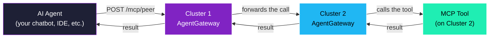
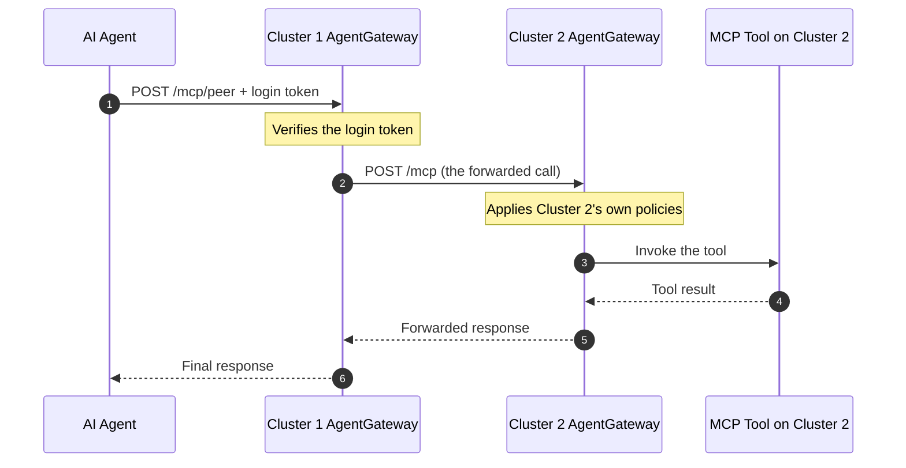

# Example 1 — One AgentGateway forwards a call to another AgentGateway

This example is for someone who is **not** a Kubernetes engineer and has not used AgentGateway before. By the end you should understand:

- What AgentGateway is doing in this picture
- Why a call from a user can land on one gateway and be answered by another
- What pieces of configuration you would change to make this happen yourself

If you want to run it, the script next to this file (`01-agw-to-agw-federation.sh`) does everything for you and explains each step as it runs. The walkthrough below explains the *why*.

---

## The setup in one sentence

There are two clusters. Each has an AgentGateway (think of it as a smart front door for AI tools). We are going to teach the front door on Cluster 1 that, for one particular URL, the answer lives behind the front door on Cluster 2 — and so it should just forward the call there.

---

## What an AI agent sees

An AI agent — the thing that makes tool calls on behalf of a chatbot, an IDE, or an automation — only ever talks to **one** address: the AgentGateway on Cluster 1.



The agent never knows Cluster 2 exists. It sent a request to Cluster 1; it got an answer back from Cluster 1. The fact that the real work happened on Cluster 2 is an implementation detail.

This matters because it means an organization can move tools between clusters, retire a cluster, add a new cluster, or rebalance load — and the AI agents never have to be reconfigured.

---

## Why bother chaining gateways at all?

There are a few different ways two clusters could share AI tools. The one shown here — AgentGateway-to-AgentGateway — is preferred for a specific reason.

| Option | What it does | Why it is not what we want here |
|---|---|---|
| Tell the agent the URL of every cluster | The agent picks which cluster to call | The agent has to know your infrastructure. Move a tool, every agent breaks. |
| Cluster 1's gateway reaches *directly* into Cluster 2's network and calls the tool pod | Bypasses Cluster 2's gateway | The policies Cluster 2's team defined (rate limits, who is allowed to use this tool, logging) are bypassed. Cluster 2 loses control of its own tools. |
| **Cluster 1's gateway forwards to Cluster 2's gateway** ✅ | Cluster 2's gateway sees the call as if it came from a normal client | Each cluster keeps full control of its own tools. The agent still only knows one URL. |

That third option is what this example builds.

---

## The four things we configure

You do not need to understand Kubernetes deeply to follow these. They are all small text changes applied via a command.

### 1. Make Cluster 2's gateway visible from Cluster 1

By default, services on Cluster 2 cannot be talked to from Cluster 1. We add a label that flips a switch — saying *"this service is allowed to be discovered from other clusters"*. After this, Cluster 1 can address Cluster 2's gateway by a hostname that ends in `.mesh.internal`.

### 2. On Cluster 1, declare Cluster 2's gateway as a destination

AgentGateway tracks every place it can forward MCP traffic to. We add one new entry — pointing it at Cluster 2's gateway. The configuration looks like this:

```yaml
host: agentgateway-spoke.agentgateway-system.mesh.internal
port: 80
path: /mcp
```

That is the entire address. Cluster 1's gateway will now treat Cluster 2's gateway *as if it were a normal MCP server*.

### 3. On Cluster 1, give that destination a URL

We need a path on Cluster 1's public address that, when called, goes to that destination. We pick `/mcp/peer`. Anyone calling `http://<cluster-1-address>/mcp/peer` will be forwarded.

### 4. Apply the same authentication rules to the new URL

The existing `/mcp` URL requires the caller to present a valid login token. We add `/mcp/peer` to that same rule — so the new URL is just as locked down.

That's it. Four small changes.

---

## What the call looks like end-to-end

Imagine an AI agent calling the tool. Here is the journey of a single request:



Notice what is happening:

- The agent sent one request and got one response. From its point of view nothing complicated happened.
- Cluster 1's gateway did the authentication check. Bad tokens never reach Cluster 2.
- Cluster 2's gateway is *also* free to enforce its own policies on the forwarded call. If Cluster 2 wants to rate-limit, audit, or filter what tools are exposed externally, that all still applies.
- Adding a third or fourth cluster is the same recipe: one more destination, one more URL.

---

## How is this different from what is already in the demo?

The POC already has a route called `/mcp/remote` that goes from Cluster 1 to a tool on Cluster 2. But that route takes a shortcut: it skips Cluster 2's gateway and goes straight to the tool. That works, but it has a cost — Cluster 2 has no opportunity to enforce its own policies on the call.

The route we add in this example (`/mcp/peer`) goes *through* Cluster 2's gateway. Same destination, but the policy boundary is respected.

| Route | Path of the call | When you would use it |
|---|---|---|
| `/mcp/remote` (existing) | Cluster 1 AGW → Cluster 2 tool directly | When the two clusters are part of the same trust boundary and Cluster 1 is the single policy enforcement point. |
| `/mcp/peer` (this example) | Cluster 1 AGW → Cluster 2 AGW → Cluster 2 tool | When the two clusters have separate ownership or separate policy and each gateway must enforce its own rules. |

---

## Run it

```
./examples/01-agw-to-agw-federation.sh
```

The script prints what it is doing at every step. The last step actually makes the federated call and shows the tool list that comes back.

To remove what the example added:

```
./examples/01-agw-to-agw-federation.sh --cleanup
```

---

## A note on going the other direction

The same recipe applies on Cluster 2 to forward calls to Cluster 1. The pattern is **symmetric** — both clusters can be both an entry point and a forwarder. The slack thread in `~/ai-gists/2026-05-18-agentgateway-mcp-federation.md` (the source for this example) goes into the bidirectional setup in more detail.

The one thing to keep in mind: if Cluster 1 forwards to Cluster 2, and Cluster 2 in turn forwards back to Cluster 1, you can create a loop. The fix is to use a *different URL* for the forwarded direction than the one the original agent calls. The script in this example does that — agents call `/mcp/peer`, which is wired only to point outward.
