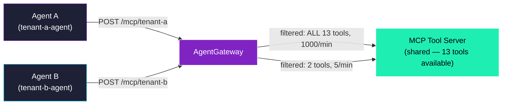
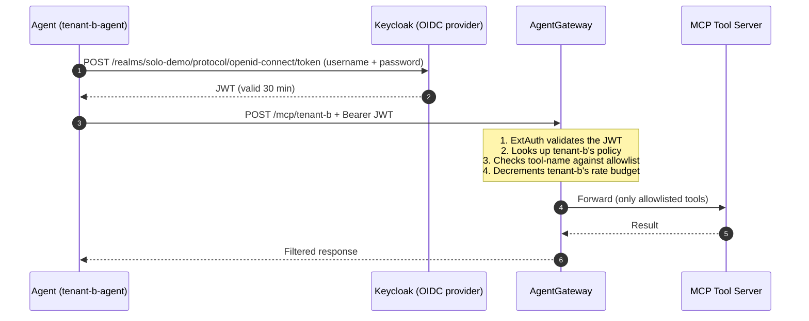

# Example 2 — Two tenants, one gateway, different policy

This example is for someone who is **not** a Kubernetes engineer and has not used AgentGateway before. By the end you should understand:

- What "multi-tenancy" means inside an AI tool gateway
- How two different agents can use the same gateway URL and get different results
- What configuration makes that happen

If you want to run it, the script next to this file (`02-multi-tenancy.sh`) does everything for you and explains each step. The walkthrough below explains the *why*.

---

## The setup in one sentence

We have one AgentGateway, two distinct "tenants" (tenant-a and tenant-b), and one URL path per tenant. The gateway enforces a different rule for each path: a different list of tools each tenant is allowed to use, and a different rate limit on how often they can call. The tools themselves run on the **same** server pod — the differentiation lives inside the gateway, not in the tools.

---

## What each tenant sees

Both tenants point their AI agent at the same AgentGateway hostname. The only thing that changes is the URL path:



Both agents reach the same gateway. The gateway looks at the path. Based on the path it decides:

1. **Which tools to expose** to that caller (tenant-a sees all 13 tools; tenant-b sees only 2)
2. **How fast they can call** (tenant-a: 1000 calls a minute; tenant-b: 5 calls a minute)

The upstream MCP server has no idea who is calling. As far as it is concerned, both requests look identical. **All differentiation happens in the gateway.**

---

## Why this pattern matters

When a single platform team operates the gateway for many product teams (or many customers), each consumer needs its own rules — but the platform team doesn't want to deploy a separate gateway, a separate cluster, or a separate copy of every tool for each tenant. Multi-tenancy in the gateway is the answer:

| Option | What it means | Why it is not what we want |
|---|---|---|
| One gateway per tenant | Each tenant gets isolated infrastructure | Costly, slow to onboard, duplicates ops surface area |
| Tenants self-serve into the same gateway with no policy | Every tenant can do whatever they want | No differentiation, no fairness, no governance |
| **One gateway, per-path policy** ✅ | Same gateway enforces different rules per URL | Cheap to onboard a new tenant, central governance, shared backends |

That third option is what this example builds.

---

## The five resources we configure per tenant

You do not need to understand Kubernetes deeply to follow these — each one is a small block of YAML.

### 1. A backend (`AgentgatewayBackend`)
Says "here is an MCP server I can route to." Both tenants' backends point at the **same** upstream server pod — they are distinct resources only so we can attach a tenant-specific tool-filter policy to each one.

### 2. A tool-RBAC policy (`AgentgatewayPolicy`)
Says "for this backend, only allow these tools." For tenant-b that is `echo` and `get-sum`; for tenant-a we omit the policy entirely, which means *all* tools pass through.

### 3. A URL path (`HTTPRoute`)
Says "when someone calls `/mcp/tenant-a` on the gateway, send the request to tenant-a's backend." The tenant-name in the path is what makes the routing decision.

### 4. A traffic policy (`EnterpriseAgentgatewayPolicy`)
Says "for this URL, require a valid OIDC login token AND apply a per-minute rate limit." This is the same policy shape used by the existing demo, just declared once per tenant so each gets its own rate limit.

### 5. An identity in Keycloak (`staticPasswords` entry)
The OIDC provider needs to recognise each tenant's username and password. These are added once when the install runs.

That is the whole pattern. Adding a third tenant is a copy-paste of the same five things with `tenant-c` substituted.

---

## What the call actually looks like



Notice what is happening:

- The agent only ever talks to one URL.
- The gateway alone decides what the agent is allowed to do.
- The tool server is shared and never sees the tenant identity.
- A different agent calling the same gateway gets a completely different policy applied — based on path, not based on the agent itself.

---

## Limit of this example

A valid login token from *any* user can hit *either* path right now. So a tenant-a user could in principle call `/mcp/tenant-b` and get tenant-b's policy applied. The convention "tenant-a uses /mcp/tenant-a" is operational rather than enforced.

Closing that gap — making the path-to-identity binding *strict* — needs identity-aware authorization (e.g. an OPA bundle that reads the JWT claim and decides whether the user is allowed to use that path). That is what example 06 (RBAC + Registry) adds.

Similarly, the per-tenant **rate limit** in this example is declared in the policy (you can see it with `kubectl get enterpriseagentgatewaypolicy multi-tenancy-tenant-b -o yaml`) but live enforcement under load is exercised in example 05 (Observability + Resilience).

What this example *does* prove live:

| Capability | Demonstrated |
|---|---|
| Per-tenant URL path | ✅ |
| Per-tenant tool allowlist (different `tools/list` per path) | ✅ |
| Per-tenant rate limit declared in policy | ✅ (live throttling: see example 05) |
| Per-tenant identity (Keycloak users) | ✅ |
| Identity-bound path scoping (only tenant-a can use /mcp/tenant-a) | ❌ — see example 06 |

---

## Run it

```
./scripts/05b-multi-tenancy.sh         # Apply the install state (idempotent)
./examples/02-multi-tenancy.sh         # Run the live demo
```

To remove what the example added:

```
./scripts/05b-multi-tenancy.sh --cleanup
```

---

## Related

- [`examples/01-agw-to-agw-federation.md`](01-agw-to-agw-federation.md) — the cross-cluster pattern; complements this one (this is per-tenant *within* one cluster; that is per-cluster federation)
- `scripts/05b-multi-tenancy.sh` — the actual install step
- `scripts/03b-keycloak.sh` — where the two tenant users are declared
