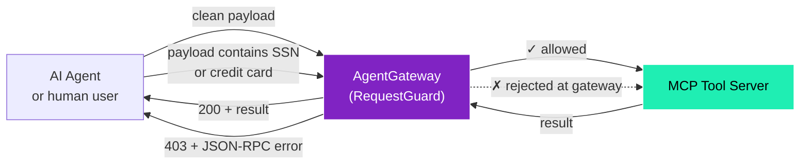
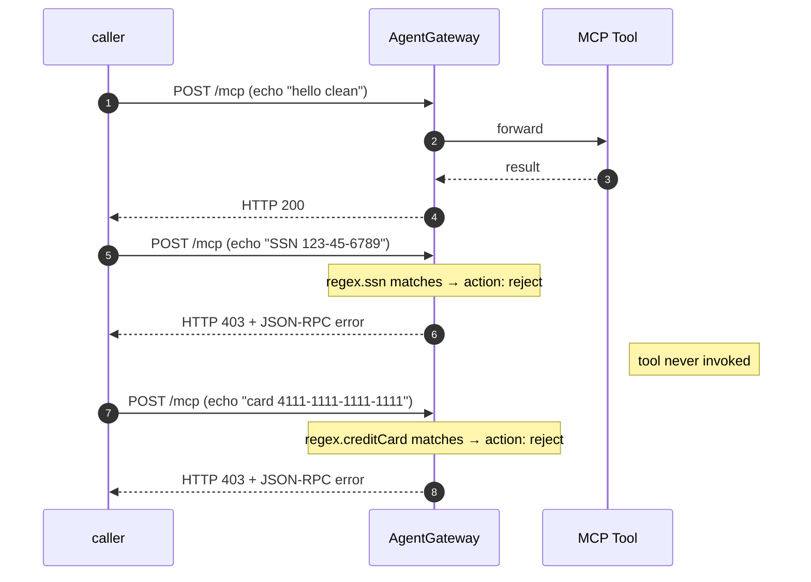

# Example 3 — Content guardrails (block PII at the gateway)

This example is for someone who is **not** a Kubernetes engineer. By the end you should understand what a "content guardrail" does in this gateway, and how a request containing personal data is stopped *before it ever reaches the tool server*.

If you want to run it: `./examples/03-guardrails.sh`. The walkthrough below explains the *why*.

---

## The setup in one sentence

We tell the gateway: "before forwarding any MCP call, scan the request body for credit card numbers or social security numbers. If you find one, reject the call with a 403 and a structured error — do not let it reach the tool server."

---

## What changes for the caller



Two callers, same gateway, same upstream tool. The clean one gets through, the one carrying personal data does not — and the tool server never sees the bad payload.

---

## How the gateway knows what "personal data" looks like

AgentGateway ships with a catalogue of built-in regex patterns that are commonly used for PII detection. You enable them by name:

| Built-in | Matches |
|---|---|
| `ssn` | US Social Security Numbers like `123-45-6789` |
| `creditCard` | Visa / MC / Amex / Discover card numbers (with or without dashes) |
| `phoneNumber` | US-style phone numbers |
| `email` | Email addresses |
| `caSin` | Canadian Social Insurance Numbers |

You can also write your own regex patterns alongside the built-ins.

For each rule you pick an **action**:
- `mask` — replace the matched substring with `***` and continue (good for redaction)
- `reject` — drop the whole request and return an HTTP error (good for hard policy)

This example uses **reject**.

---

## The configuration

A single Kubernetes resource attaches the guard to a backend (the destination the gateway can forward to). From `scripts/05c-guardrails.sh`:

```yaml
apiVersion: agentgateway.dev/v1alpha1
kind: AgentgatewayPolicy
spec:
  targetRefs:
  - group: agentgateway.dev
    kind: AgentgatewayBackend
    name: mcp-backends
  backend:
    mcp:
      guard:
        request:
          regex:
            action: reject
            rules:
            - builtin: ssn
            - builtin: creditCard
          rejection:
            status: 403
            body: |
              {"jsonrpc":"2.0","error":{"code":-32000,"message":"blocked by content policy (PII detected)"}}
```

That is the entire change. No custom code, no sidecar service, no separate webhook deployment. The regex catalogue lives inside the gateway binary.

---

## What the example script actually does



Three calls, three different outcomes.

---

## Extending it

To add more rules, edit `scripts/05c-guardrails.sh` and append entries to `rules:`. Use the named built-ins above, or write your own:

```yaml
rules:
- builtin: ssn
- builtin: creditCard
- pattern: '\bAKIA[0-9A-Z]{16}\b'      # AWS access key
- pattern: '(?i)ignore previous instructions'  # prompt-injection marker
```

To switch a rule from rejecting to masking, change `action: reject` to `action: mask`. The matched substring becomes `***` in what the upstream sees.

For responses (the data coming *back* from a tool — e.g. preventing the model from leaking PII it discovered), set `guard.response` instead of `guard.request` with the same shape. The example does not cover that for brevity.

---

## What this example does *not* do

| Capability | Status |
|---|---|
| Reject by **regex** (built-in or custom) | ✅ — what this example shows |
| Reject by **AI content-safety vendor** (Azure / OpenAI Moderation / Bedrock / Google Model Armor) | Available — set `guard.request.bedrockGuardrails` / `azureContentSafety` / etc. instead of `regex`. Same policy shape |
| Validate JSON-RPC envelope shape (drop calls missing `jsonrpc`/`method`/`id`) | ❌ — no native field. Upstream MCP server returns the standard `-32600` if the envelope is malformed |
| Validate tool arguments against the tool's declared `inputSchema` | ❌ — not enforced by the gateway. The upstream MCP server is responsible |

---

## Run it

```
./scripts/05c-guardrails.sh         # Apply the guard policy
./examples/03-guardrails.sh         # Run the three test calls
./scripts/05c-guardrails.sh --cleanup  # Remove
```
