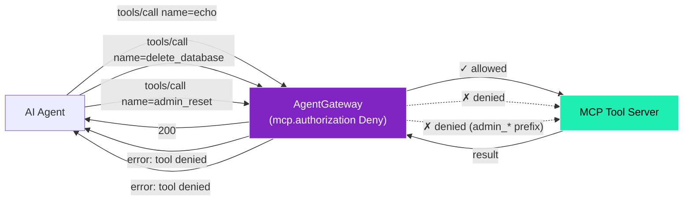

# Example 3 — MCP guardrails (what works today)

This example is for someone who is **not** a Kubernetes engineer. It walks through what content guardrails exist for MCP traffic in Solo CRD v2.3.3, and is explicit about what is *not* yet supported.

To run it: `./scripts/05c-guardrails.sh` then `./examples/03-guardrails.sh`.

---

## The honest picture

When this example was first scoped, the plan was to demonstrate native PII-regex filtering on MCP bodies (SSN, credit card, phone number) using AgentGateway's built-in pattern catalogue. After validating against the live cluster, the reality turned out to be more nuanced:

| Capability | AgentGateway OSS schema | Solo CRD v2.3.3 | Demo |
|---|---|---|---|
| Built-in PII regex on AI/LLM body content | ✅ `mcp.guard.regex.builtin` | ✅ `backend.ai.promptGuard.regex.builtins` | not in this POC (no AI backend deployed) |
| Built-in PII regex on **MCP** body content | ✅ in OSS config | ❌ field exists under `backend.ai`, only fires on AI backends | not possible today |
| Tool-name allow/deny via CEL | ✅ | ✅ `backend.mcp.authorization.matchExpressions` with `mcp.tool.name` | **what this example shows** |
| CEL match on `mcp.tool.arguments` | partial | only post-request, not for authorization decisions | not possible today |
| External webhook (ExtProc) on MCP traffic | ✅ | ✅ via `GatewayExtension` | placeholder in `scripts/09-optional-components.sh` |
| Bedrock / Azure / OpenAI / Google content backends | ✅ | ✅ for `backend.ai` only | future package |

The verdict: **for MCP traffic in v2.3.3, the gateway gives you tool-name authorization at request time. For body-content filtering, you go through ExtProc (Solo's webhook hook) or wait for the AI-backend guardrails to be extended to MCP backends in a future release.**

---

## What this example actually demonstrates

A tool-name DENY blocklist. The gateway rejects calls to dangerous-named tools before any upstream MCP server is reached.



---

## The configuration

```yaml
apiVersion: agentgateway.dev/v1alpha1
kind: AgentgatewayPolicy
metadata:
  name: guardrails-mcp-backends
spec:
  targetRefs:
  - group: agentgateway.dev
    kind: AgentgatewayBackend
    name: mcp-backends
  backend:
    mcp:
      authorization:
        action: Deny
        policy:
          matchExpressions:
          - 'mcp.tool.name == "delete_database"'
          - 'mcp.tool.name == "exfiltrate_data"'
          - 'mcp.tool.name == "drop_table"'
          - 'mcp.tool.name.startsWith("admin_")'
```

`action: Deny` means *if any expression evaluates true*, deny the call. `action: Allow` (used in Example 2 for tenant tool allowlists) is the inverse — allow only if all expressions match.

CEL expressions available at request time on MCP traffic:
- `mcp.tool.name` — the requested tool name
- `mcp.tool.target` — the resolved upstream target
- `mcp.prompt.name` / `mcp.resource.name` — for prompts/resources

Not available at request time: `mcp.tool.arguments` (only available post-request, useful for response transformation but not for blocking).

---

## What you'd do for body-content filtering today

Two paths, both already scaffolded in the POC repo:

| Path | Where | Notes |
|---|---|---|
| **ExtProc webhook** | `scripts/09-optional-components.sh` section 5 deploys a placeholder Python passthrough ExtProc. Wire a real PII scanner (regex, F5 Calypso, custom model) into the `GatewayExtension` and `AgentgatewayPolicy` already created there | Universal — runs on every MCP body. Highest flexibility, requires running a service |
| **Bedrock / Azure / OpenAI / Model Armor** | These backends are configurable on `backend.ai.promptGuard` today. To use them on MCP traffic, you'd need either (a) a Solo CRD update extending promptGuard to MCP backends, or (b) a thin AI-backend wrapper that proxies MCP through an AI route | Managed vendor PII / content-safety. Less code, requires vendor accounts |

---

## What this example does *not* do

| Capability | Status |
|---|---|
| Tool-name allow/deny via CEL | ✅ — live |
| Built-in PII regex on MCP bodies | ❌ — not in Solo CRD v2.3.3 for MCP backends. Available for `backend.ai` (AI/LLM) backends |
| Tool-arguments inspection at request time | ❌ — CEL exposes `mcp.tool.arguments` only post-request |
| JSON-RPC envelope schema enforcement (drop malformed bodies) | ❌ — upstream MCP servers return the standard `-32600` |
| Vendor content backends on MCP traffic (Bedrock / Azure / etc.) | ❌ — wired for AI backends only in v2.3.3 |

---

## Run it

```
./scripts/05c-guardrails.sh        # Apply the tool-name Deny policy
./examples/03-guardrails.sh        # Run the three test calls
./scripts/05c-guardrails.sh --cleanup
```
