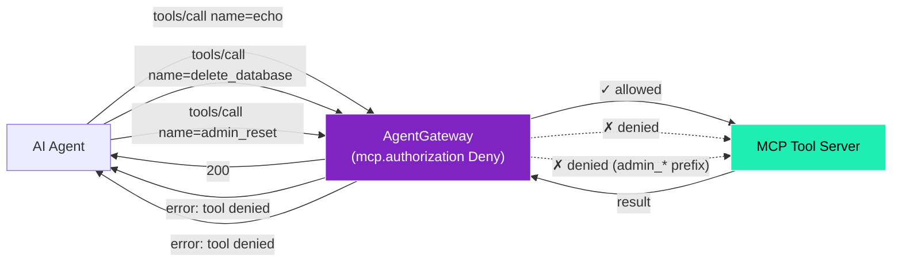
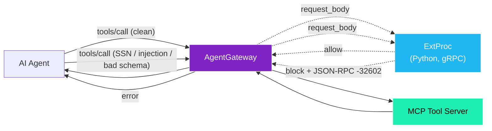

# Example 3 — MCP guardrails (what's live today)

This example is for someone who is **not** a Kubernetes engineer. It walks through what content guardrails exist for MCP traffic in Solo CRD v2.3.3 and what each layer catches.

To run it: `./scripts/05c-guardrails.sh` and `./scripts/09b-extproc-guardrails.sh`, then `./examples/03-guardrails.sh` (tool-name policy) and `./examples/08-extproc-guardrails.sh` (body-content scanner).

---

## The honest picture

The POC has **two complementary guardrail layers** wired up:

| Capability | Solo CRD v2.3.3 | This POC |
|---|---|---|
| Tool-name allow/deny via CEL | ✅ `backend.mcp.authorization.matchExpressions` with `mcp.tool.name` | ✅ live — `scripts/05c-guardrails.sh` |
| External webhook (ExtProc) on MCP request bodies | ✅ via `traffic.extProc.backendRef` on an EnterpriseAgentgatewayPolicy | ✅ live — `scripts/09b-extproc-guardrails.sh` (Python ExtProc) |
| JSON-RPC envelope + tool-argument schema validation | via ExtProc | ✅ — hardcoded `TOOL_SCHEMAS` dict per tool, rejects extra/missing/mistyped args |
| Built-in PII regex on AI/LLM body content | ✅ `backend.ai.promptGuard.regex.builtins` | not in this POC (no AI backend deployed) |
| Built-in PII regex on **MCP** body content | ❌ field exists under `backend.ai`, only fires on AI backends | covered via ExtProc instead |
| CEL match on `mcp.tool.arguments` at request time | only post-request, not for authorization decisions | covered via ExtProc instead |
| Bedrock / Azure / OpenAI / Google content backends | ✅ for `backend.ai` only | future package |

The verdict: **tool-name authorization handles known-bad tool calls at the AGW native layer; everything that needs to look inside the request body — PII, prompt injection, schema enforcement — runs through the ExtProc service wired to the `oidc-extauth` policy.** Both layers fire before the upstream MCP server is touched.

---

## What this example actually demonstrates

A tool-name DENY blocklist. The gateway rejects calls to dangerous-named tools before any upstream MCP server is reached.



---

## The configuration

```yaml
apiVersion: agentgateway.dev/v1alpha1
kind: AgentgatewayPolicy
metadata:
  name: guardrails-mcp-backends
spec:
  targetRefs:
  - group: agentgateway.dev
    kind: AgentgatewayBackend
    name: mcp-backends
  backend:
    mcp:
      authorization:
        action: Deny
        policy:
          matchExpressions:
          - 'mcp.tool.name == "delete_database"'
          - 'mcp.tool.name == "exfiltrate_data"'
          - 'mcp.tool.name == "drop_table"'
          - 'mcp.tool.name.startsWith("admin_")'
```

`action: Deny` means *if any expression evaluates true*, deny the call. `action: Allow` (used in Example 2 for tenant tool allowlists) is the inverse — allow only if all expressions match.

CEL expressions available at request time on MCP traffic:
- `mcp.tool.name` — the requested tool name
- `mcp.tool.target` — the resolved upstream target
- `mcp.prompt.name` / `mcp.resource.name` — for prompts/resources

Not available at request time: `mcp.tool.arguments` (only available post-request, useful for response transformation but not for blocking).

---

## Body-content filtering — what the ExtProc layer adds

`scripts/09b-extproc-guardrails.sh` deploys a Python ExtProc (`envoy_data_plane==2.0.0b9` with `betterproto2`) wired to the `oidc-extauth` `EnterpriseAgentgatewayPolicy` via `traffic.extProc.backendRef`. It runs on every MCP request body bound for any route that policy covers (`/mcp`, `/mcp/tenant-*`, `/mcp/peer`, etc.), and inspects them before the upstream MCP server is touched.

What it catches today (each rejection returns JSON-RPC `-32602` with a descriptive message):

| Pattern | Rule |
|---|---|
| Social Security Number | `\b\d{3}-\d{2}-\d{4}\b` |
| Credit card | `\b\d{4}[- ]\d{4}[- ]\d{4}[- ]\d{4}\b` (tight enough to avoid `2024-11-05` MCP protocolVersion false-positives) |
| Prompt injection | `(?i)ignore (all )?previous instructions`, `<\|im_start\|>` |
| Exfiltration markers | `(?i)exfiltrate|exfil-?data` |
| Tool-argument schema | `tools/call` params validated against a per-tool `TOOL_SCHEMAS` dict; extra/missing/mistyped fields rejected (closes Biraj's 5/18 "block when agent sends 3-4 params for a 2-param tool" ask) |



Run `./examples/08-extproc-guardrails.sh` for six live test cases (1 clean + 5 blocked).

For managed vendor PII / content-safety (Bedrock / Azure / OpenAI / Model Armor) you'd still need either (a) a Solo CRD update extending `backend.ai.promptGuard` to MCP backends, or (b) an AI-backend wrapper that proxies MCP through an AI route — both are future-package work.

---

## What this example does *not* do

| Capability | Status |
|---|---|
| Tool-name allow/deny via CEL | ✅ — live (this example) |
| ExtProc body-content scanning (PII / injection / exfil / schema) | ✅ — live (`scripts/09b-extproc-guardrails.sh` + `examples/08-extproc-guardrails.sh`) |
| Built-in PII regex on **AI/LLM** bodies via `backend.ai.promptGuard` | ❌ — no AI backend deployed in this POC |
| Vendor content backends on MCP traffic (Bedrock / Azure / etc.) | ❌ — `promptGuard` is wired for AI backends only in v2.3.3 |
| Response-body scanning (server → agent) | ❌ — current ExtProc inspects request bodies only; response scanning is a future enhancement |

---

## Run it

```
./scripts/05c-guardrails.sh        # Apply the tool-name Deny policy
./examples/03-guardrails.sh        # Run the three tool-name test calls

./scripts/09b-extproc-guardrails.sh   # Deploy the body-content ExtProc
./examples/08-extproc-guardrails.sh   # Run the six body-content test cases

./scripts/05c-guardrails.sh --cleanup
./scripts/09b-extproc-guardrails.sh --cleanup
```
