# Example 4 — OAuth 2.1 hardening (PKCE, RFC 9728, m2m)

This example is for someone who is **not** a Kubernetes engineer but may have heard "OAuth 2.1" in a security review. By the end you should understand what changed compared to plain OAuth 2.0 and how to take advantage of the new pieces.

To run it: `./scripts/05d-oauth21.sh` then `./examples/04-oauth21.sh`.

---

## What OAuth 2.1 actually changes

OAuth 2.1 is a consolidation of OAuth 2.0 plus some BCPs (best-current-practices). It does not invent a new protocol. The visible differences are:

| OAuth 2.0 | OAuth 2.1 |
|---|---|
| Browser flow with bearer tokens, optional PKCE | Browser flow **must** use PKCE |
| Password grant allowed (`grant_type=password`) | Password grant **deprecated / removed** |
| Implicit flow allowed | Implicit flow **removed** |
| Refresh tokens long-lived | Refresh tokens **rotated** (each refresh issues a new RT, invalidates the old) |
| Resource discovery out-of-band | RFC 9728 metadata document at a known URL |

Three pieces matter for this demo:

1. **PKCE** on the auth-code flow.
2. **Client-credentials** flow for service-to-service calls (replaces password grant for agents that don't have a human user).
3. **RFC 9728 protected-resource-metadata** so an MCP client can discover the auth server without being told.

---

## Diagram — the three flows side by side

```mermaid
flowchart TB
    subgraph "Flow A — PKCE auth-code (browser users)"
      A1["Agent generates<br/>code_verifier + code_challenge"]
      A2["Redirect to Keycloak /auth<br/>with code_challenge"]
      A3["User logs in"]
      A4["Keycloak redirects back<br/>with code"]
      A5["Agent POSTs code +<br/>code_verifier to /realms/solo-demo/protocol/openid-connect/token"]
      A6["Bearer JWT"]
      A1 --> A2 --> A3 --> A4 --> A5 --> A6
    end

    subgraph "Flow B — Client-credentials (service-to-service)"
      B1["Agent has client_id +<br/>client_secret"]
      B2["POST /realms/solo-demo/protocol/openid-connect/token<br/>grant_type=client_credentials"]
      B3["Bearer JWT"]
      B1 --> B2 --> B3
    end

    subgraph "Flow C — Resource discovery (RFC 9728)"
      C1["MCP client hits /mcp<br/>without a token"]
      C2["Gateway returns 401<br/>WWW-Authenticate: Bearer<br/>resource_metadata=URL"]
      C3["Client fetches the URL"]
      C4["JSON document with<br/>auth server, scopes, audiences"]
      C5["Client now knows where<br/>to get a token"]
      C1 --> C2 --> C3 --> C4 --> C5
    end

    style A6 fill:#1FEEB3,stroke:#fff,color:#000
    style B3 fill:#1FEEB3,stroke:#fff,color:#000
    style C5 fill:#1FEEB3,stroke:#fff,color:#000
```



---

## What configuration adds each piece

### PKCE
No gateway change. Keycloak *accepts* PKCE when the auth-code request carries a `code_challenge` and `code_challenge_method=S256`. The example script generates the verifier + challenge with `openssl` and walks the first step:

```bash
CODE_VERIFIER=$(openssl rand -base64 96 | tr -d "=+/\n" | cut -c1-128)
CODE_CHALLENGE=$(printf "%s" "${CODE_VERIFIER}" | openssl dgst -sha256 -binary \
                  | base64 | tr "+/" "-_" | tr -d "=\n")
curl "http://<lb>/realms/solo-demo/protocol/openid-connect/auth?...&code_challenge=${CODE_CHALLENGE}&code_challenge_method=S256"
```

For an MCP client (e.g. an editor) to actually finish this flow, the user would log into Keycloak in the browser; on the redirect back, the client posts the received `code` + the original `code_verifier` to `/realms/solo-demo/protocol/openid-connect/token`.

### Client-credentials (service-to-service)
We add a second Keycloak client `mcp-service` whose `grantTypes` list includes `client_credentials`:

```yaml
staticClients:
- id: mcp-service
  name: "OAuth 2.1 MCP Service Client (client-credentials)"
  secret: "mcp-service-secret"
  grantTypes:
  - client_credentials
  redirectURIs:
  - http://localhost/callback   # required by Keycloak but unused for this grant
```

Then a service agent gets a token with no human in the loop:

```bash
TOKEN=$(curl -s -X POST "http://<lb>/realms/solo-demo/protocol/openid-connect/token" \
  -d 'grant_type=client_credentials' \
  -d 'client_id=mcp-service' \
  -d 'client_secret=mcp-service-secret' \
  -d 'scope=openid' | jq -r '.access_token')
```

### RFC 9728 protected-resource-metadata
`scripts/05d-oauth21.sh` creates a dedicated `mcp-wellknown` HTTPRoute (two exact path matches, not behind ExtAuth) and attaches an `EnterpriseAgentgatewayPolicy` using `traffic.jwtAuthentication.mcp` with `provider: Keycloak` + `resourceMetadata`. AGW's MCP-auth handler intercepts the well-known paths and returns the RFC-compliant JSON itself — the backend reference is unused for these paths.

```yaml
apiVersion: gateway.networking.k8s.io/v1
kind: HTTPRoute
metadata:
  name: mcp-wellknown
spec:
  parentRefs:
  - {name: agentgateway-hub, namespace: agentgateway-system}
  rules:
  - matches:
    - {path: {type: Exact, value: /.well-known/oauth-protected-resource/mcp}}
    - {path: {type: Exact, value: /.well-known/oauth-authorization-server/mcp}}
    backendRefs:
    - {group: "", kind: Service, name: mcp-server-everything, port: 80}
---
apiVersion: enterpriseagentgateway.solo.io/v1alpha1
kind: EnterpriseAgentgatewayPolicy
metadata:
  name: mcp-resource-metadata
spec:
  targetRefs:
  - {group: gateway.networking.k8s.io, kind: HTTPRoute, name: mcp-wellknown}
  traffic:
    jwtAuthentication:
      mode: Strict
      providers:
      - issuer: http://<lb>/realms/solo-demo
        audiences: [agw-client]
        jwks:
          remote:
            backendRef: {kind: Service, name: keycloak, namespace: keycloak, port: 8080}
            jwksPath: /realms/solo-demo/protocol/openid-connect/certs
            cacheDuration: 5m
      mcp:
        provider: Keycloak
        resourceMetadata:
          resource: http://<lb>/mcp
          scopesSupported: [openid, email, profile]
          bearerMethodsSupported: [header]
          resourceDocumentation: https://docs.solo.io/agentgateway/
```

Live response from the cluster:

```bash
$ curl http://<lb>/.well-known/oauth-protected-resource/mcp
{
  "resource": "http://<lb>/mcp",
  "authorization_servers": ["http://<lb>/mcp"],
  "mcp_protocol_version": "2025-06-18",
  "resource_type": "mcp-server",
  "bearer_methods_supported": ["header"],
  "scopes_supported": ["openid", "email", "profile"]
}
```

The companion `/.well-known/oauth-authorization-server/mcp` returns Keycloak's OpenID-configuration document (AGW proxies + transforms it). An MCP client that follows the standard 401 → metadata → auth-server discovery dance can now wire itself up without any out-of-band configuration.

**Note:** the well-known route is intentionally not in `oidc-extauth.targetRefs` — public discovery is the point. The `/mcp` route itself still requires auth (session cookie via ExtAuth, or Bearer JWT).

---

## What this example does *not* do

| Capability | Status |
|---|---|
| PKCE on auth-code flow | ✅ — Keycloak accepts the challenge, example demonstrates the handshake |
| Client-credentials grant | ✅ — `mcp-service` Keycloak client; example acquires a token via `grant_type=client_credentials` |
| RFC 9728 protected-resource-metadata | ✅ — live at `/.well-known/oauth-protected-resource/mcp` on the AGW LB (200, RFC-compliant JSON) |
| RFC 8414 authorization-server-metadata | ✅ — live at `/.well-known/oauth-authorization-server/mcp` (AGW proxies + transforms Keycloak's OIDC discovery doc) |
| **Disable password grant** | ❌ — left enabled deliberately. `send-traffic.sh` depends on it. To remove, set `directAccessGrantsEnabled=false` on the Keycloak `agw-client` (`kcadm.sh update clients/<id>`) |
| **Refresh-token rotation** | ❌ — Keycloak supports it; configure via Realm Settings → Tokens → Revoke refresh token to require rotation on every refresh |
| **Dynamic Client Registration (RFC 7591)** | ❌ — The simple realm import is not DCR-enabled; admin-issued client credentials are used |

---

## Run it

```
./scripts/05d-oauth21.sh        # Apply Keycloak realm + resource metadata
./examples/04-oauth21.sh        # Run the three checks
./scripts/05d-oauth21.sh --cleanup
```
