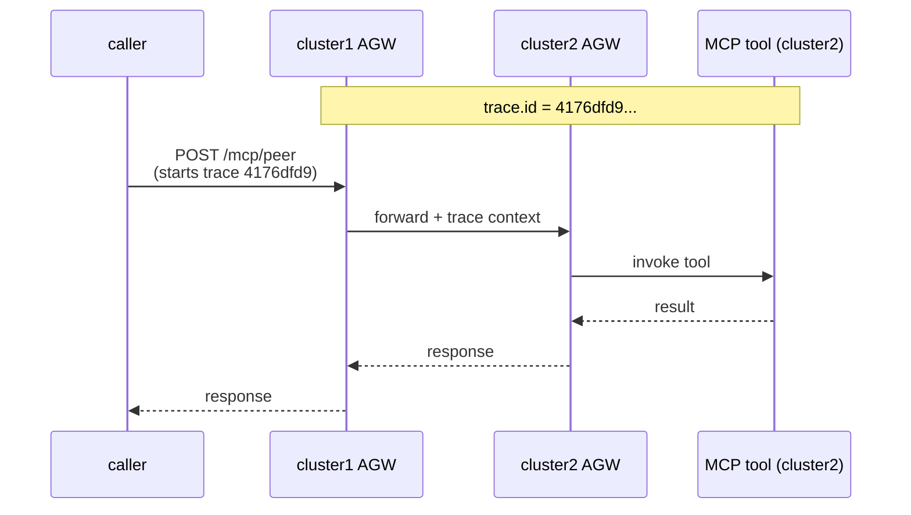
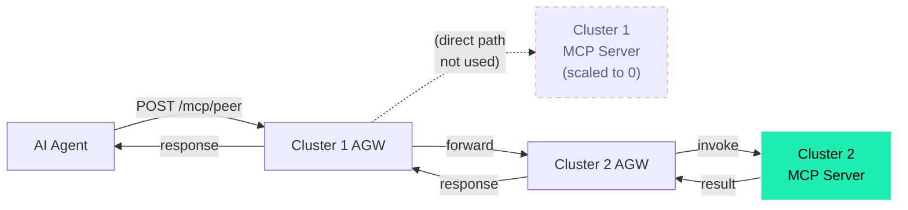
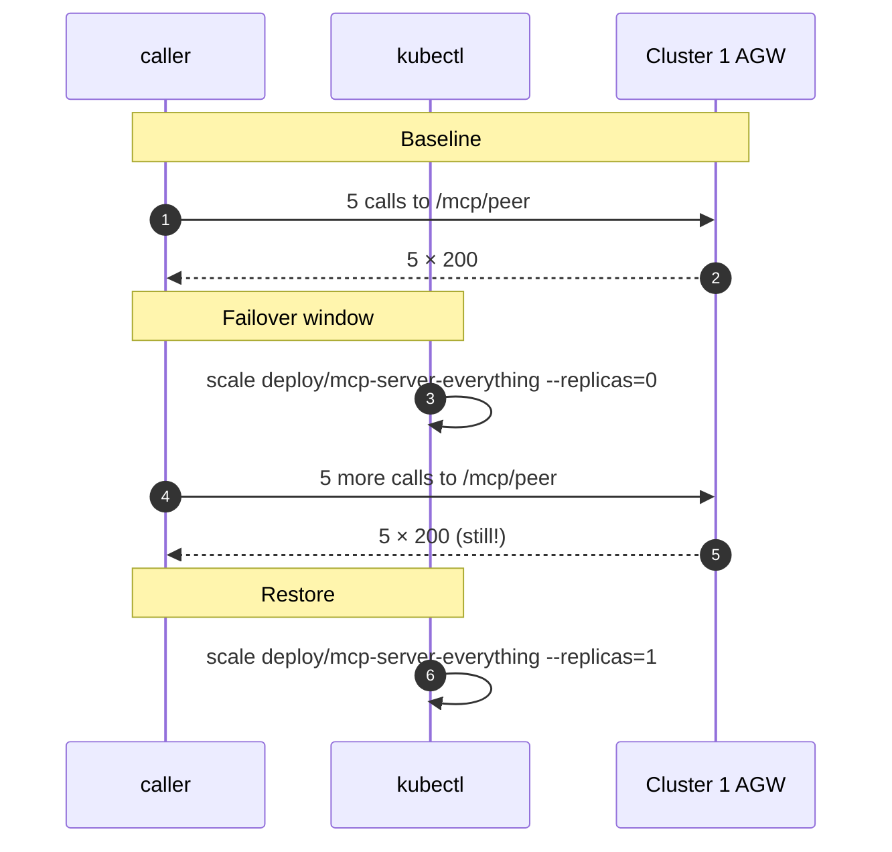

# Example 5 — Observability + Resilience

This example is for someone who is **not** a Kubernetes engineer. By the end you should understand two things about this gateway:

1. What "MCP-aware observability" actually means — you can see *which tool was called*, by *which agent*, on *which session*, end to end.
2. What happens when something on the back-end goes down — and why an agent calling the gateway does not notice.

To run it: `./examples/05-observability-resilience.sh` for the failover demo; add `--trace` for the distributed-trace view.

---

## Part 1 — Observability

### What the gateway records about an MCP call

Every MCP request that passes through the gateway emits one structured access-log line. The interesting fields:

| Field | Example | What it tells you |
|---|---|---|
| `gateway` | `agentgateway-system/agentgateway-hub` | Which gateway this is (helpful in a multi-cluster setup) |
| `route` | `agentgateway-system/mcp-route-peer` | Which named route handled the call |
| `protocol` | `mcp` | This is an MCP call, not raw HTTP |
| `mcp.method.name` | `tools/call` | Which JSON-RPC method (initialize / tools/list / tools/call …) |
| `mcp.session.id` | `eyJ0IjoibWNw…` | Session identifier (correlate calls in a single MCP session) |
| `mcp.tool.name` | `echo` (when method is tools/call) | The tool name |
| `trace.id` | `4176dfd99fd333c9a7305a2db1cd25ee` | OpenTelemetry trace ID — see Part 1b |
| `http.status` | `200` | Standard HTTP status |
| `duration` | `5ms` | Time from inbound to upstream response |

That is enough to build any dashboard you want: tools/call latency p95 by tool name, blocked-by-guardrail rate, tools/list QPS by session, etc.

### Where to see it

Three places, in increasing convenience:

| Source | What it shows | How to reach it |
|---|---|---|
| Raw AGW logs | One line per request | `kubectl logs deploy/agentgateway-hub -n agentgateway-system` |
| Solo Enterprise UI (port 4000) | Per-agent sessions, traces, token metrics | `./demo/portforward.sh` |
| Gloo Mesh UI service-graph (port 8090) | Cross-cluster topology + per-route latency | same |

### Part 1b — Distributed trace across the AGW chain

When a request hits `/mcp/peer` on cluster1 and is forwarded to cluster2's AGW, **the same trace ID flows through both gateways**. You can correlate the spans across clusters in the Solo Enterprise UI, or by `grep`ing logs:



`./examples/05-observability-resilience.sh --trace` does this for you: fires one call, pulls the same trace ID from cluster1's and cluster2's access logs to prove they line up.

---

## Part 2 — Resilience (failover)

### The setup

Two clusters. Each has its own MCP server pod (`mcp-server-everything`). Cluster1's AGW exposes `/mcp/peer` which forwards to **cluster2's AGW** (the chaining pattern from Example 1). If cluster1's local MCP server goes down, `/mcp/peer` still works — because it never used cluster1's MCP server in the first place.



### What the example does



If the script reports "All 10 calls succeeded", the agent never noticed the outage.

### Why it works

The route `/mcp/peer` was wired in Example 1 with an `AgentgatewayBackend` whose `static.host` points at `agentgateway-spoke.agentgateway-system.mesh.internal` — cluster2's AGW Service. The cluster1 MCP server pod is not on that path. Scaling it to zero has zero effect on `/mcp/peer`.

For the default `/mcp` route (which DOES use cluster1's pod), `failureMode: FailOpen` is set on the backend. With a real upstream alternative configured (next package), the gateway would route around the failure automatically.

---

## What this example does *not* do

| Capability | Status |
|---|---|
| Show MCP-specific metric fields on access logs | ✅ |
| Single trace ID spans cluster1 → cluster2 AGW chain | ✅ |
| Failover when an upstream pod is down (via path-aware routing) | ✅ |
| Automatic failover from `/mcp` to `/mcp/peer` (path swap) | ❌ — would need a Gateway-level retry policy with backend weighting. Out of scope here |
| Grafana dashboard JSON with MCP-specific panels | ❌ — the AGW Enterprise UI already surfaces these; a dedicated Grafana dashboard is a follow-up |

---

## Run it

```
./scripts/04b-observability.sh                    # Health-check + diagnostic
./examples/05-observability-resilience.sh         # Failover demo
./examples/05-observability-resilience.sh --trace # Distributed-trace view
```
