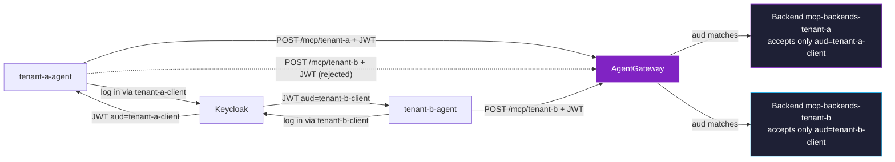
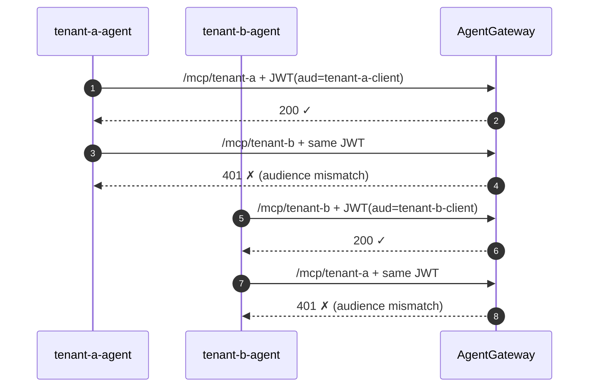

# Example 6 — Strict identity-bound path scoping

This example is for someone who is **not** a Kubernetes engineer. By the end you should understand what changed from Example 2 (multi-tenancy by convention) to a *hard* enforcement model where each tenant can only use its own URL.

To run it: `./scripts/05e-rbac-strict.sh` then `./examples/06-rbac-and-registry.sh`.

---

## What Example 2 did, and why it wasn't enough

Example 2 gave each tenant its own URL (`/mcp/tenant-a`, `/mcp/tenant-b`) and its own policies. But authentication was the same on both paths — *any* logged-in user could call either URL. The "this path is yours" assignment was a convention, not an enforced rule.

In a real deployment that's a problem: tenant A could discover tenant B's URL and use its more permissive policy (or vice-versa). We need each path to *only* accept tokens issued for that tenant.

---

## How OAuth audiences solve this

When an identity provider (Keycloak) issues a JWT, it can stamp the JWT with an **audience** — the intended consumer of the token. The convention is one audience per OAuth client. If tenant-a logs in via the `tenant-a-client` Keycloak client, the JWT has `aud: tenant-a-client`. Tenant-b logs in via `tenant-b-client`, JWT has `aud: tenant-b-client`.

The gateway can then declare, per backend, *which audiences it accepts*. A JWT with the wrong audience is rejected at the gateway with HTTP 401 — the upstream tool server never sees it.



---

## What the install script changes

```yaml
# Per-tenant backend gets an authentication block with audience restriction
apiVersion: agentgateway.dev/v1alpha1
kind: AgentgatewayPolicy
metadata:
  name: rbac-strict-tenant-a
spec:
  targetRefs:
  - group: agentgateway.dev
    kind: AgentgatewayBackend
    name: mcp-backends-tenant-a
  backend:
    mcp:
      authentication:
        issuer: "http://<lb>/realms/solo-demo"
        audiences:
        - "tenant-a-client"      # ← only this audience is allowed
```

And in Keycloak's configmap, two new `staticClients`:

```yaml
staticClients:
- id: tenant-a-client
  secret: tenant-a-client-secret
  redirectURIs: ["http://localhost/callback"]
- id: tenant-b-client
  secret: tenant-b-client-secret
  redirectURIs: ["http://localhost/callback"]
```

Tenant-a logs in with `client_id=tenant-a-client`, gets a JWT whose `aud` is `tenant-a-client`. That JWT works on `/mcp/tenant-a` and fails on `/mcp/tenant-b`.

---

## What the example demonstrates



Four calls, two each from each tenant. The cross-tenant attempts are blocked at the gateway.

---

## What this example does *not* do

| Capability | Status |
|---|---|
| Per-tenant Keycloak clients with distinct audiences | ✅ |
| Audience-restricted gateway backend (cross-tenant blocked) | ✅ |
| Per-tool RBAC by JWT role/group claim | ❌ — the per-tenant tool allowlists from Example 2 still operate by *path*. Per-tool filtering keyed on a JWT `groups` claim requires OPA or a custom CEL bundle |

---

## Run it

```
./scripts/05e-rbac-strict.sh         # Add per-tenant Keycloak clients + audience policies
./examples/06-rbac-and-registry.sh   # Run the four checks
./scripts/05e-rbac-strict.sh --cleanup
```
