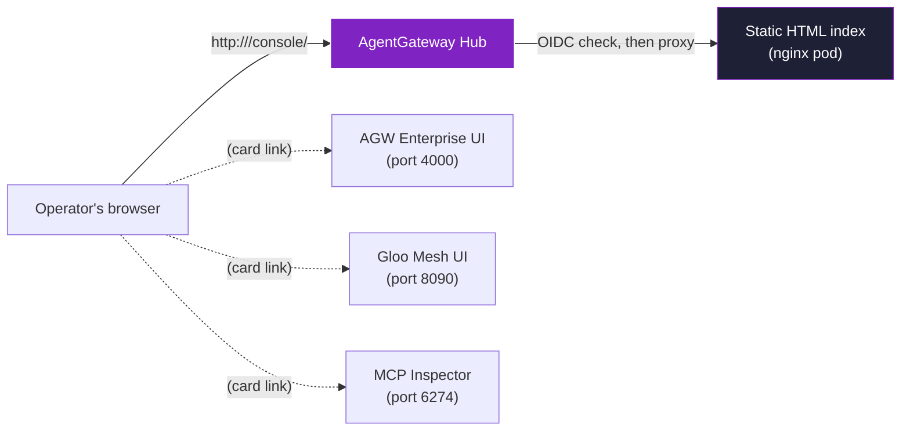

# Example 7 — Single Control Plane (unified console)

This example is for someone who is **not** a Kubernetes engineer. The goal: one URL bookmarks the entire platform.

To run it: `./scripts/04d-unified-console.sh` then open `http://<agw-lb>/console/`.

---

## The setup in one sentence

There are three UIs in this POC (AgentGateway Enterprise, Gloo Mesh, MCP Inspector). Each lives on a different port. The unified console is a static index page served by the gateway itself at `/console/` — one URL, behind the same OIDC, with cards linking to all three.

---

## The layout



---

## Why this is "single control plane" and not just an HTML page

Two things make this more than a bookmark:

1. **It is gated by the same OIDC as the rest of the platform.** Hitting `/console/` without a valid OIDC login redirects to Keycloak's login page, just like `/mcp` does. One login, one credential surface for the operator.

2. **It is served by the platform itself.** The index page lives inside the gateway's namespace, deployed by the same Helm/script flow as everything else. No external hosting, no per-laptop static file to lose track of.

The card links inside the page do still point at `localhost` ports for the individual UIs (which the operator port-forwards via `./demo/portforward.sh`). That's a deliberate choice — it keeps existing demo flow intact. A production deployment would expose each UI behind its own gateway HTTPRoute (e.g. `/console/agw → solo-enterprise-ui`) and remove the port-forward dependency.

---

## What's behind it (so you can extend it)

The install script (`scripts/04d-unified-console.sh`) creates:

| Resource | Purpose |
|---|---|
| `ConfigMap/console-ui` | The static HTML page |
| `Deployment/console-ui` | Nginx pod that serves the ConfigMap |
| `Service/console-ui` | In-cluster Service |
| `AgentgatewayBackend/console-backend` | Tells AGW the upstream is the Nginx service |
| `HTTPRoute/console-route` | Maps `/console` on the AGW LB to the backend |
| (patch on `oidc-extauth`) | Adds `console-route` to the OIDC-protected route list |

To add a new card, edit the HTML inside the ConfigMap. The format is one `<a class="card">` block per UI.

---

## What this example does *not* do

| Capability | Status |
|---|---|
| Single URL the operator opens to reach every UI | ✅ |
| Behind the same OIDC as /mcp | ✅ |
| Eliminate the need for portforward.sh | ❌ — cards still point at localhost ports for the UIs themselves. A production hand-off would route each UI through the gateway LB directly |
| Embed the UIs inline in the console (iframes) | ❌ — most enterprise UIs reject framing via X-Frame-Options. Card-link approach is the practical default |
| Show real-time health badges on each card | ❌ — possible future enhancement (JS that polls each UI's healthz) |

---

## Run it

```
./scripts/04d-unified-console.sh        # Deploy the console
./examples/07-unified-console.sh        # Sanity-check the route
./scripts/04d-unified-console.sh --cleanup
```
